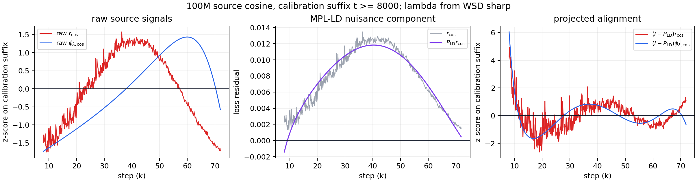
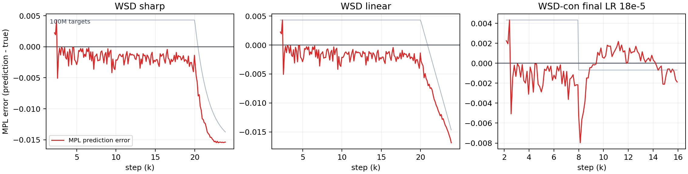
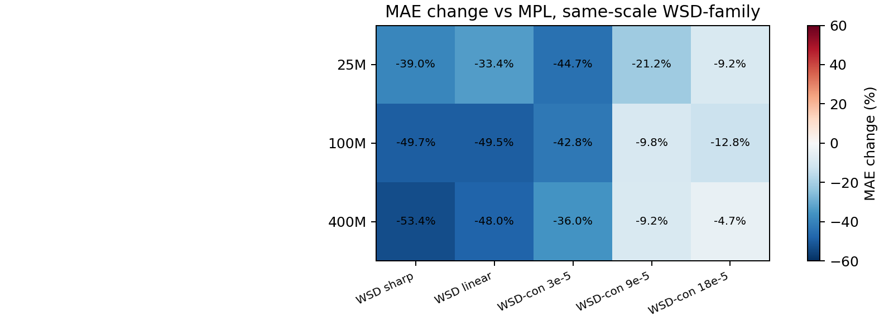
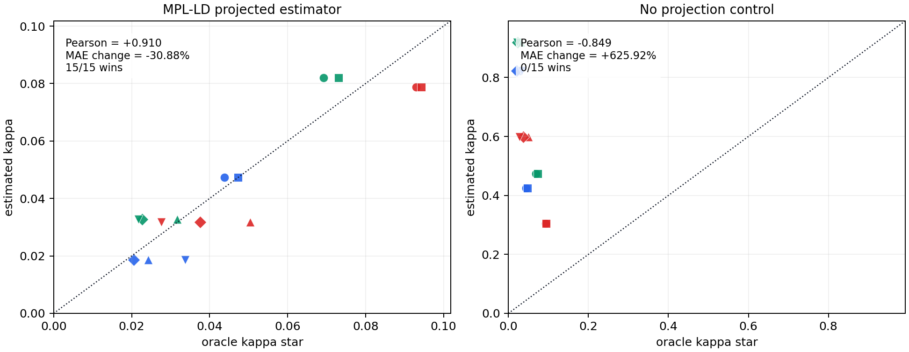

# DL-final

**From Cosine to WSD: Identifying Transferable LR-Drop Response in MPL Residuals**

这个项目研究一个很具体的问题：如果我们已经观察到 `cosine` 学习率计划下的公开训练损失曲线，能不能在不读取目标 `WSD-family` 损失曲线的情况下，预测目标 WSD 曲线的形状？

项目的核心不是再拟合一个更复杂的 loss law，而是把 MPL baseline 的残差拆开看：哪些残差来自学习率下降带来的可迁移响应，哪些只是 MPL-LD 参数漂移造成的不可迁移干扰。最后使用的预测器刻意保持低容量，只在源 cosine 曲线上估计一个标量响应强度，再把它迁移到目标学习率计划。



## 研究问题

学习率计划会改变训练曲线在 transition 和 tail 区域的形状。MPL 已经是一个很强的 baseline，但在 WSD 过渡区附近仍然留下有结构的误差。直接把 cosine residual 搬到 WSD 上会失败，因为 raw residual 混合了两类信号：

```text
transferable LR-drop response
+ non-transferable MPL-LD parameter drift
```

因此，这个项目把 cosine-to-WSD transfer 视为一个识别问题：先投影掉 MPL-LD nuisance tangent，再只迁移与学习率下降响应相关的分量。



## 方法摘要

部署时使用的预测形式是：

```text
L_hat_s(t) = L_MPL,s(t) + kappa_hat_s * phi_{lambda_s,s}(t)
```

- `L_MPL,s(t)`：冻结的 MPL baseline。
- `phi_{lambda_s,s}(t)`：只由目标学习率计划计算出的因果 LR-drop response feature。
- `kappa_hat_s`：唯一从残差中拟合的标量，在源 cosine residual 上估计。
- 目标 WSD loss 只用于最后评估和 oracle 诊断，不参与校准或预测。

这使得实验边界非常清楚：预测阶段只使用源 cosine 曲线、目标 LR schedule 和冻结 MPL baseline。

## 主要证据

同尺度 `25M / 100M / 400M` 的 cosine source 到 WSD-family targets 上，投影后的 source-only correction 相比 MPL 取得稳定改善：



| Evidence | Result |
| --- | ---: |
| Same-scale WSD-family mean MAE change vs MPL | `-30.88%` |
| Worst WSD-family row | `-4.67%` |
| WSD-family wins | `15/15` |
| Projected `kappa_hat` vs target oracle `kappa_star` Pearson | `+0.910` |
| No-projection negative control | `+625.92%`, `0/15` wins |
| Leave-one-scale-out mean-kappa transfer | `-25.62%`, `15/15` wins |



负对照很关键：如果不做 MPL-LD 投影，直接从 raw cosine residual 估计响应强度，会把低频漂移也迁移过去，导致 `+625.92%` 的 MAE 恶化。这说明结果不是“随便加一个修正项”，而是需要识别可迁移残差分量。

## 仓库内容

| Path | Purpose |
| --- | --- |
| `slides/` | 中文和英文展示稿，以及项目主图。 |
| `repro/` | 复现 baseline 和 projected-kappa audit 的最小脚本。 |
| `results/schedule_response_robustness/` | 主结果报告、target-leakage audit 和汇总 CSV。 |
| `external/MultiPowerLaw/loss_curve_repo/` | 项目使用的公开 loss curve CSV。 |
| `REPRODUCIBILITY.md` | 命令级复现说明。 |
| `DATA_MANIFEST.md` | 数据边界和文件来源说明。 |

## 快速复现

安装依赖：

```bash
pip install -r requirements.txt
```

复现主 audit：

```bash
python3 repro/schedule_response_robustness_audit.py
```

复现 MPL 与 Tissue/Momentum baseline 对比：

```bash
python3 repro/reproduce_cosine_to_wsd.py --scales 25 100 400
```

编译展示稿：

```bash
cd slides
xelatex -interaction=nonstopmode main_zh.tex
xelatex -interaction=nonstopmode main_zh.tex
pdflatex -interaction=nonstopmode main.tex
pdflatex -interaction=nonstopmode main.tex
```

## 数据边界

公开曲线位于：

```text
external/MultiPowerLaw/loss_curve_repo/csv_25/
external/MultiPowerLaw/loss_curve_repo/csv_100/
external/MultiPowerLaw/loss_curve_repo/csv_400/
```

每个 scale 包含 `cosine_72000.csv` 作为 source curve，以及 `wsd_20000_24000.csv`、`wsdld_20000_24000.csv`、`wsdcon_3.csv`、`wsdcon_9.csv`、`wsdcon_18.csv` 等目标曲线。仓库不声称做了新的 transformer 训练；公开复现路径只依赖已提交的 CSV 曲线和 CPU 友好的分析脚本。

## 结论边界

这个项目支持的结论是：

- 在提交的 WSD-family 公开曲线上，source-only projected cosine calibration 能识别 MPL baseline 上方的可迁移 LR-drop response。
- MPL-LD projection 是必要步骤；raw residual transfer 会失败。
- 当前方法是低容量规则，每个 source scale / response shape 只拟合一个残差标量。

不声称：

- 得到通用训练损失定律。
- 解决所有 WSD-con final-LR 排序问题。
- 完成新训练出来的 held-out WSD schedule 的前瞻验证。
