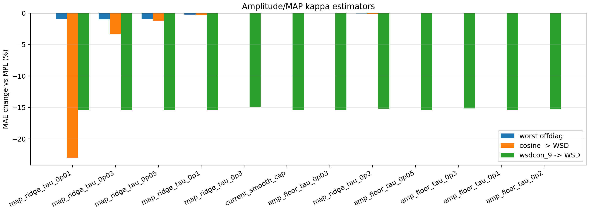
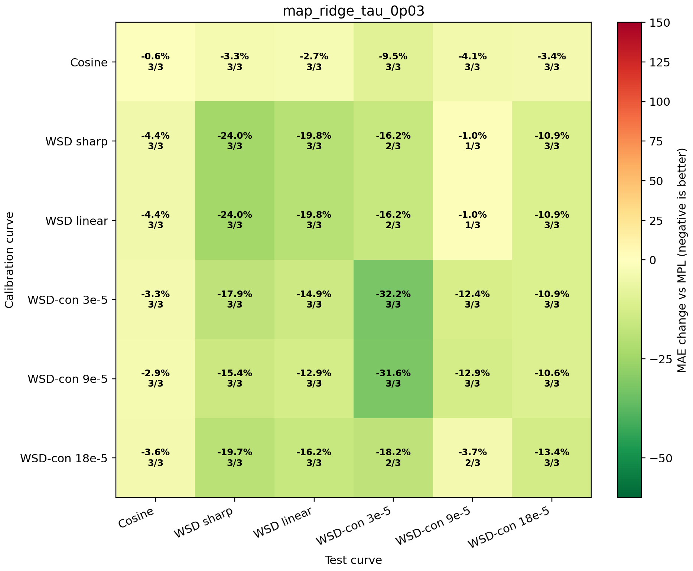

# Amplitude-Regularized Kappa Search

This experiment targets the observed failure mode: the residual response shape is often usable, but raw `kappa=<phi,r>/<phi,phi>` can have the wrong magnitude when `phi` has low feature energy.

## Estimators

- `current_smooth_cap`: previous continuous identifiability-weighted estimator.
- `map_ridge_tau_*`: MAP/ridge estimator `kappa=max(0,<phi,r>/(||phi||^2 + tau^2/w_id))`, capped at `0.03`.
- `amp_floor_tau_*`: estimates normalized loss-space amplitude `<phi/||phi||,r>`, then divides by `sqrt(||phi||^2+tau^2)`.
- `amp_cap_tau_*`: additionally caps the loss-space amplitude by a robust residual scale before conversion to kappa.

The MAP form has the cleanest theory: under `r=kappa phi+epsilon` with Gaussian noise and a zero-centered Gaussian prior on `kappa`, the posterior mode is ridge regression. Setting prior precision proportional to `1/w_id` makes low-identifiability curves shrink continuously toward zero rather than exploding through the denominator.

## Top Comparison

| estimator | worst offdiag | median offdiag | cosine -> WSD | wsdcon_9 -> WSD |
|---|---:|---:|---:|---:|
| `map_ridge_tau_0p01` | -0.9% | -12.6% | -23.0% | -15.4% |
| `map_ridge_tau_0p03` | -1.0% | -10.9% | -3.3% | -15.4% |
| `map_ridge_tau_0p05` | -1.0% | -10.9% | -1.2% | -15.4% |
| `map_ridge_tau_0p1` | -0.2% | -10.9% | -0.3% | -15.4% |
| `map_ridge_tau_0p3` | -0.0% | -10.9% | -0.0% | -14.9% |
| `current_smooth_cap` | -0.0% | -10.9% | -0.0% | -15.4% |
| `amp_floor_tau_0p03` | -0.0% | -10.9% | -0.0% | -15.4% |
| `map_ridge_tau_0p2` | -0.1% | -10.9% | -0.1% | -15.2% |
| `amp_floor_tau_0p05` | -0.0% | -10.9% | -0.0% | -15.4% |
| `amp_floor_tau_0p3` | -0.0% | -10.9% | -0.0% | -15.1% |
| `amp_floor_tau_0p1` | -0.0% | -10.9% | -0.0% | -15.4% |
| `amp_floor_tau_0p2` | -0.0% | -10.9% | -0.0% | -15.3% |

## Recommended Candidate

Recommended by the current safety/useful-transfer objective: `map_ridge_tau_0p03`.

This recommendation intentionally rejects `map_ridge_tau_0p01` even though it has stronger aggregate numbers, because cosine-derived kappa hits the `0.03` cap there. The selected candidate keeps cosine-derived kappa below `0.01`, so the improvement is coming from reliability-weighted MAP shrinkage rather than from a saturated cap.

Important caveat: this is still a finite-data estimator search, not a proof of universal optimality. The structural improvement is that magnitude control is now expressed as a MAP/energy prior rather than as a schedule-class rule.
