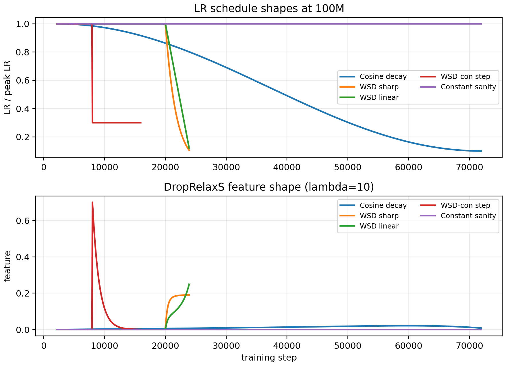
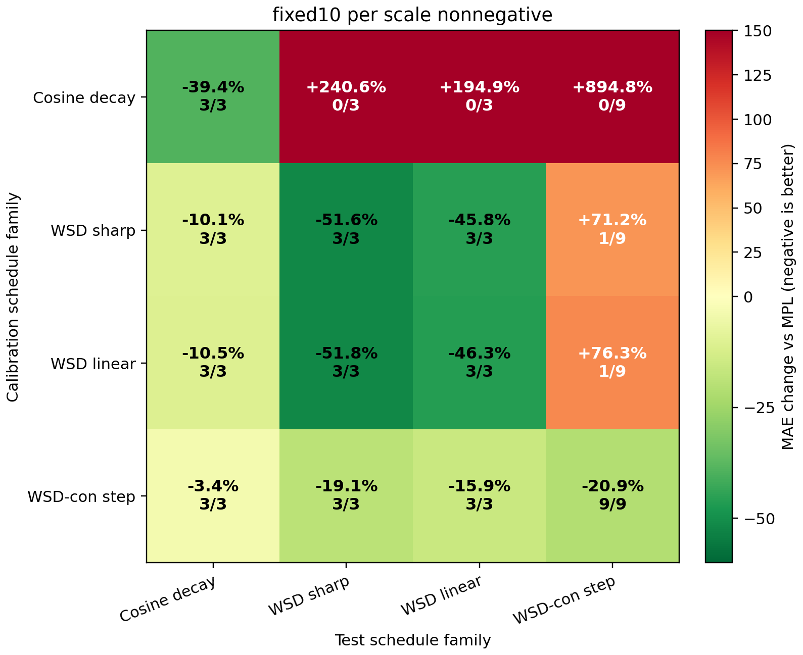
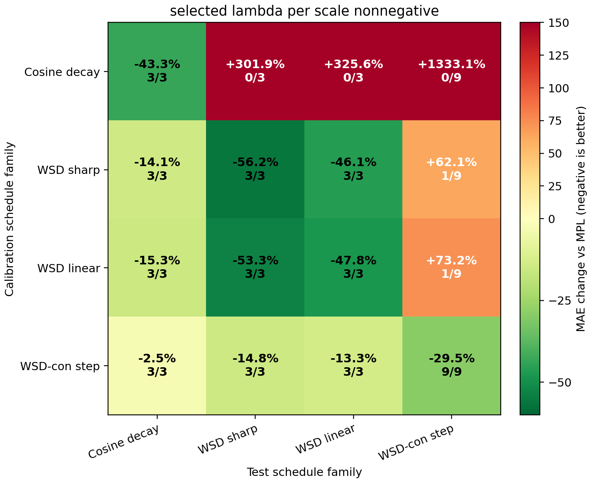
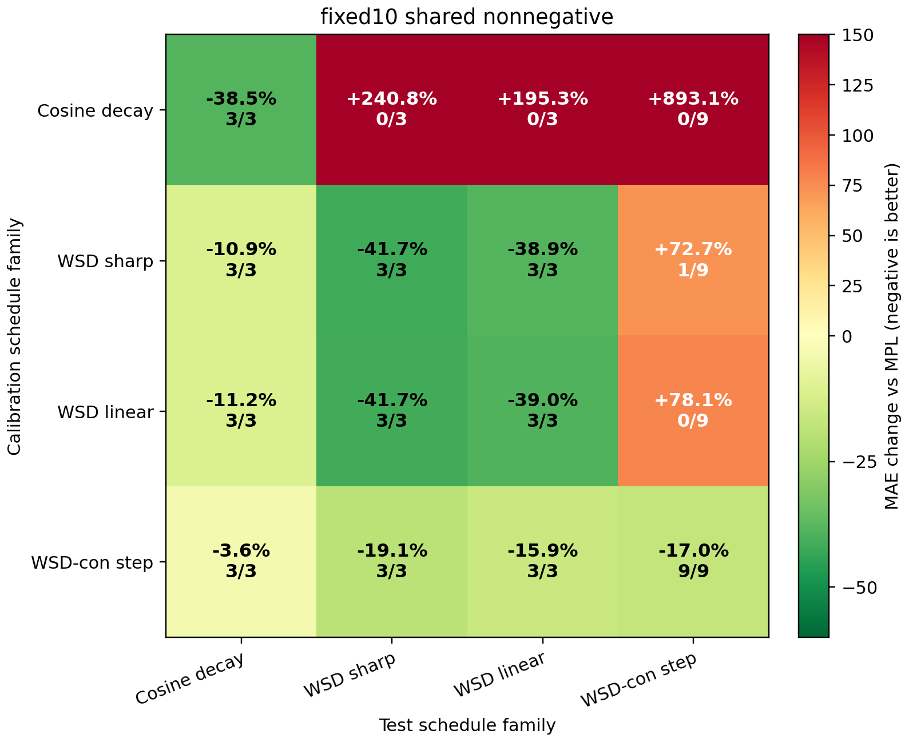
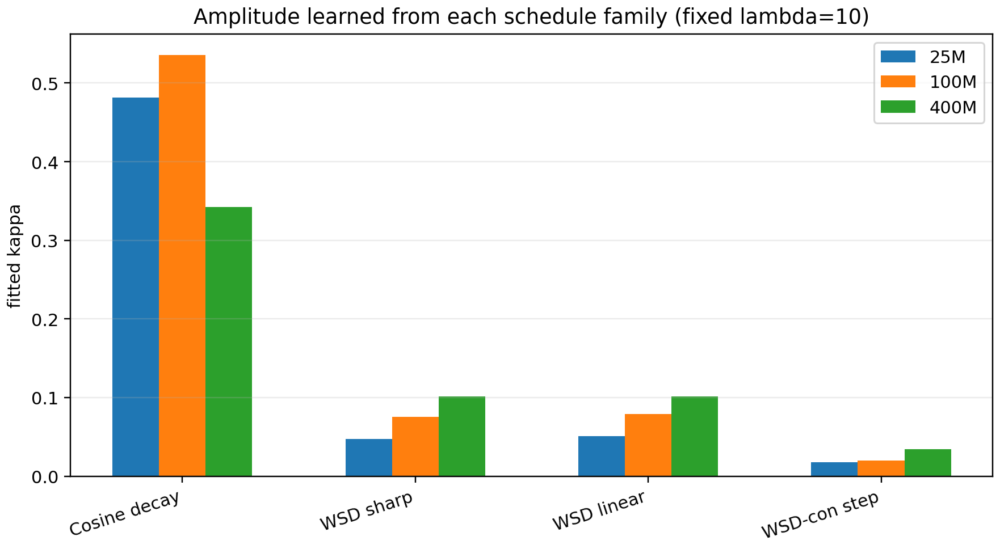
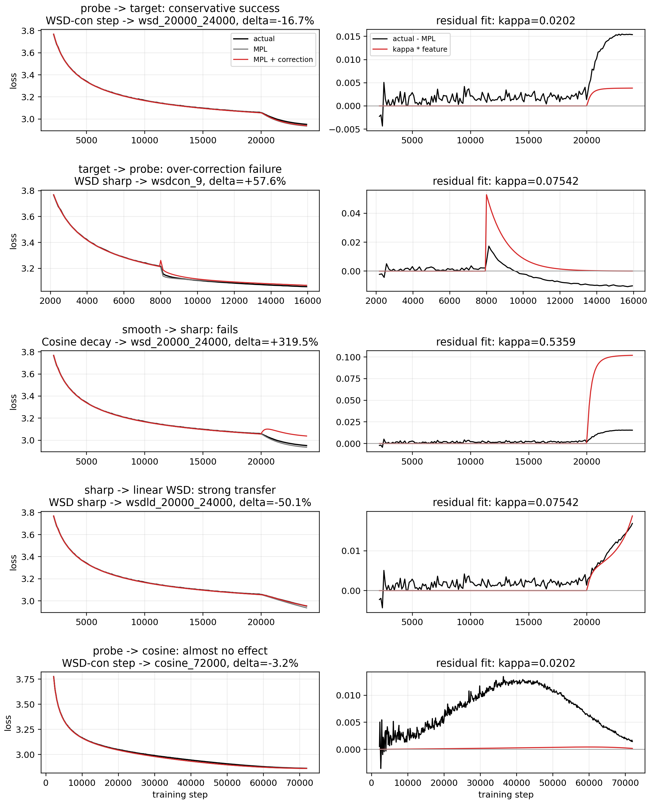
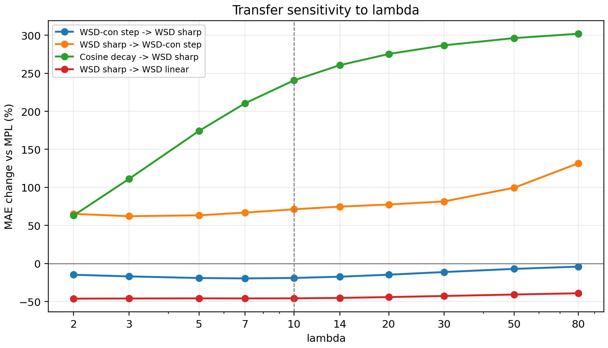

# Current-Law Behavior Report

Formula under audit: `prediction = cosine-fit MPL + kappa * DropRelaxS_lambda`.

This report is intentionally diagnostic. It does not try to make the method look universal; it shows where the correction transfers, where it over-corrects, and which fitting choices change the conclusion.

## Schedule and Feature Geometry

- Constant LR has essentially zero positive-drop feature after warmup, so the correction cannot do anything there.
- Cosine produces many small drops spread over a long horizon; WSD sharp creates a late concentrated cooldown; WSD-con creates a discrete drop followed by a long constant-tail relaxation probe.

## Main Matrix: fixed lambda=10, nonnegative per-scale kappa

| key transfer | MAE change | wins | reading |
|---|---:|---:|---|
| `WSD-con step -> WSD sharp` | -19.1% | 3/3 | clean no-target-WSD probe; stable but conservative |
| `WSD sharp -> WSD-con step` | +71.2% | 1/9 | over-corrects probe tails |
| `Cosine decay -> WSD sharp` | +240.6% | 0/3 | smooth-decay calibration does not transfer to sharp cooldown |
| `WSD sharp -> WSD linear` | -45.8% | 3/3 | strong transfer inside WSD-like cooldowns |
| `WSD-con step -> Cosine decay` | -3.4% | 3/3 | almost no useful correction needed |

## Alternative Fitting Plans

These are not new formulas. They only change how `lambda` and `kappa` are fitted.

### Lambda selected on the train family

Selecting `lambda` on the training family can improve the diagonal cells, but it does not fix bad cross-family transfers. The main failure is amplitude/shape mismatch, not merely a poor fixed value of `lambda`.

### Shared kappa across scales

A single shared `kappa` is a stricter amplitude assumption. It usually weakens the result because the residual amplitude is scale-dependent.

### Signed kappa

Allowing negative `kappa` is useful as a diagnostic, but it violates the positive-lag interpretation. The defensible theory version keeps `kappa >= 0`.

## Learned Amplitudes

| scale | train family | kappa |
|---:|---|---:|
| 25M | Cosine decay | 0.48142 |
| 25M | WSD sharp | 0.04770 |
| 25M | WSD linear | 0.05101 |
| 25M | WSD-con step | 0.01774 |
| 100M | Cosine decay | 0.53587 |
| 100M | WSD sharp | 0.07542 |
| 100M | WSD linear | 0.07879 |
| 100M | WSD-con step | 0.02020 |
| 400M | Cosine decay | 0.34238 |
| 400M | WSD sharp | 0.10121 |
| 400M | WSD linear | 0.10164 |
| 400M | WSD-con step | 0.03469 |

The important pattern is that cosine calibration learns a very large amplitude for a smooth distributed feature, which then badly over-corrects sharp/step schedules. WSD-con learns a smaller amplitude; it under-fits sharp WSD but transfers in the right direction.

## Representative Curve Fits at 100M

| scenario | train family | test curve | kappa | MAE change |
|---|---|---|---:|---:|
| probe -> target: conservative success | WSD-con step | `wsd_20000_24000` | 0.02020 | -16.7% |
| target -> probe: over-correction failure | WSD sharp | `wsdcon_9` | 0.07542 | +57.6% |
| smooth -> sharp: fails | Cosine decay | `wsd_20000_24000` | 0.53587 | +319.5% |
| sharp -> linear WSD: strong transfer | WSD sharp | `wsdld_20000_24000` | 0.07542 | -50.1% |
| probe -> cosine: almost no effect | WSD-con step | `cosine_72000` | 0.02020 | -3.2% |

## Lambda Sensitivity

`lambda=10` is a reasonable theory-first operating point, but the plots show the more important fact: some train/test families remain bad across the lambda range. That is evidence of schedule-family mismatch, not a tuning accident.

## Bottom Line

1. The formula has a real, interpretable success case: `WSD-con step -> WSD sharp` gives stable conservative improvement without using a full WSD target curve.
2. The formula is not universal: `cosine -> WSD` and `WSD sharp -> WSD-con` are clear failures.
3. The deciding factor is not simply more calibration data. It is whether the calibration schedule excites the same relaxation shape and amplitude as the target schedule.
4. For the paper, the honest claim should stay narrow: a low-calibration sharp-cooldown correction, not a general residual smoother.
