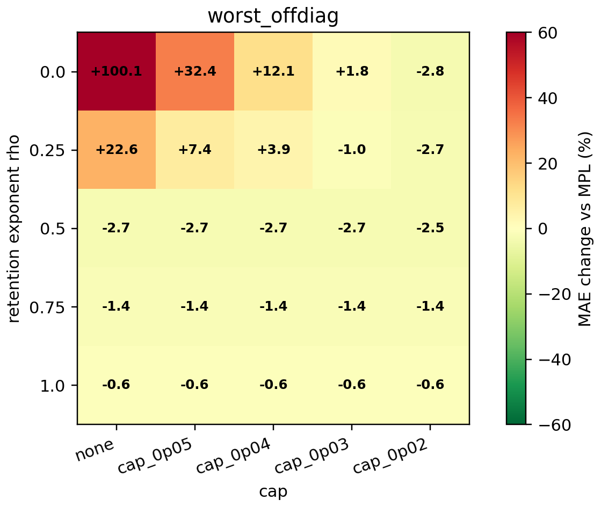
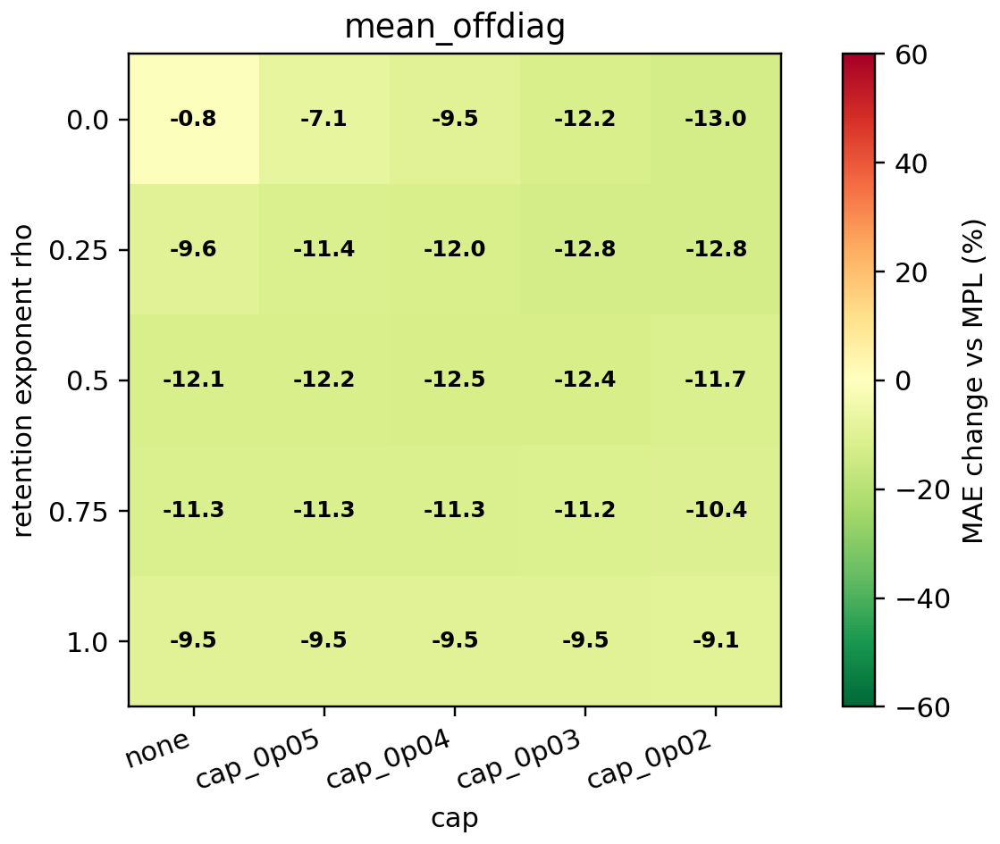
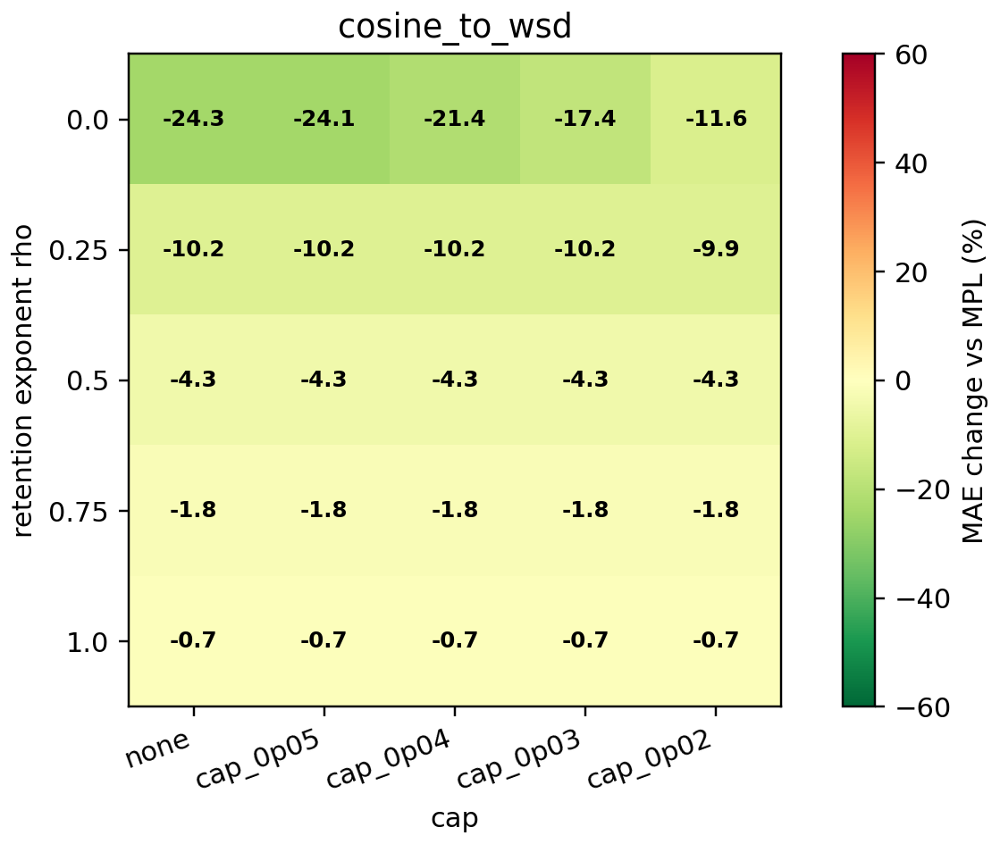

# Cap Sensitivity for Nuisance-Orthogonal Kappa

This audit checks whether the recommended degree-2 nuisance-orthogonal MAP estimator depends critically on the hard susceptibility cap.

## Top Variants

| estimator | worst offdiag | median offdiag | mean offdiag | cosine -> WSD | wsdcon_9 -> WSD | max cosine kappa | cap saturation |
|---|---:|---:|---:|---:|---:|---:|---:|
| `orth_deg2_rho_0p0_cap_0p02` | -2.8% | -11.1% | -13.0% | -11.6% | -15.3% | 0.0200 | 83.3% |
| `orth_deg2_rho_0p25_cap_0p02` | -2.7% | -11.1% | -12.8% | -9.9% | -14.7% | 0.0200 | 66.7% |
| `orth_deg2_rho_0p25_cap_0p03` | -1.0% | -10.8% | -12.8% | -10.2% | -16.9% | 0.0212 | 38.9% |
| `orth_deg2_rho_0p5_cap_0p04` | -2.7% | -10.3% | -12.5% | -4.3% | -16.0% | 0.0089 | 11.1% |
| `orth_deg2_rho_0p5_cap_0p03` | -2.7% | -10.6% | -12.4% | -4.3% | -15.9% | 0.0089 | 16.7% |
| `orth_deg2_rho_0p5_cap_0p05` | -2.7% | -10.0% | -12.2% | -4.3% | -16.0% | 0.0089 | 5.6% |
| `orth_deg2_rho_0p5_none` | -2.7% | -10.0% | -12.1% | -4.3% | -16.0% | 0.0089 | 0.0% |
| `orth_deg2_rho_0p5_cap_0p02` | -2.5% | -11.1% | -11.7% | -4.3% | -13.7% | 0.0089 | 50.0% |
| `orth_deg2_rho_0p75_cap_0p04` | -1.4% | -10.0% | -11.3% | -1.8% | -14.4% | 0.0037 | 0.0% |
| `orth_deg2_rho_0p75_cap_0p05` | -1.4% | -10.0% | -11.3% | -1.8% | -14.4% | 0.0037 | 0.0% |
| `orth_deg2_rho_0p75_none` | -1.4% | -10.0% | -11.3% | -1.8% | -14.4% | 0.0037 | 0.0% |
| `orth_deg2_rho_0p75_cap_0p03` | -1.4% | -10.1% | -11.2% | -1.8% | -14.4% | 0.0037 | 11.1% |

## Sensitivity Maps

## Reading

Recommended paper setting: `orth_deg2_rho_0p5_cap_0p03`. Best cap-free setting: `orth_deg2_rho_0p5_none`.

If cap-free variants remain non-catastrophic, the cap is not carrying the entire method. If capped variants are clearly better, the cap should be described as a susceptibility prior rather than hidden as a tuning trick.
