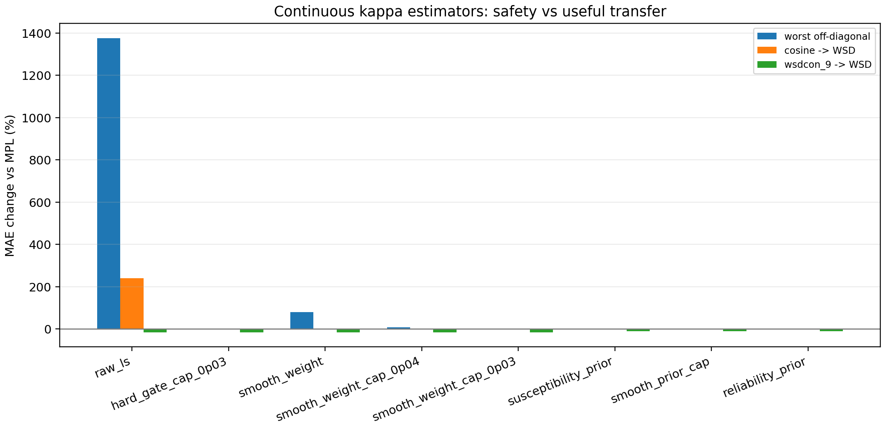
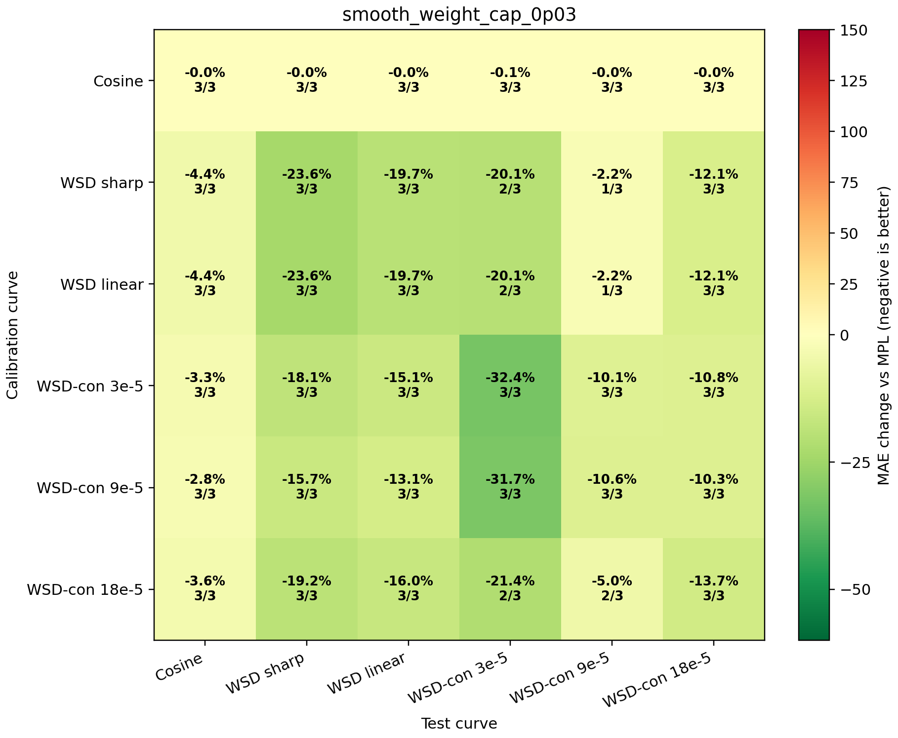
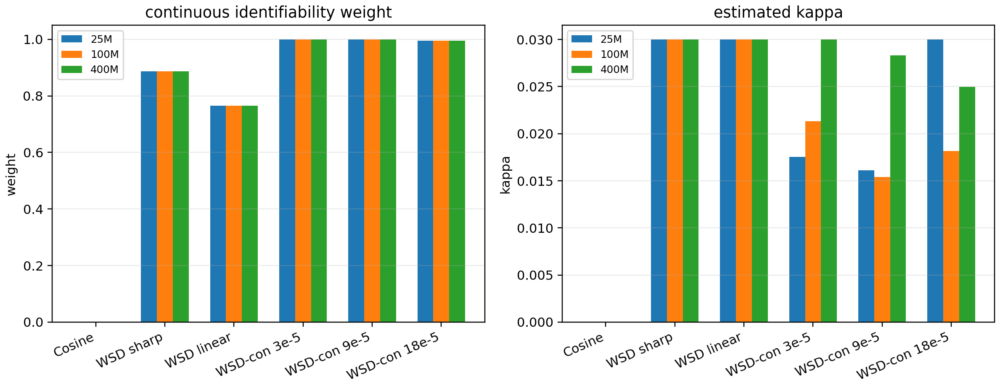

# Continuous Kappa Formula Search

This report removes the hard schedule-family classification. Every estimator uses only curve-derived quantities: the DropRelaxS feature `phi`, the MPL residual `r`, and LR-drop concentration statistics.

## Candidate formulas

- `raw_ls`: `k_raw = max(0, <phi,r>/<phi,phi>)`.
- `smooth_weight`: `k = k_raw * w_id`, where `w_id` is a smooth identifiability weight.
- `smooth_weight_cap_0p03`: `k = min(k_raw * w_id, 0.03)`.
- `reliability_prior`: additionally shrinks by residual-feature alignment and positive-overlap reliability.

The smooth identifiability weight is:

```text
w_id = sigmoid(3 log(6000 / drop_effective_steps))
    * sigmoid(3 log(feature_max / 0.05))
    * sigmoid(3 log(total_positive_drop / 0.05))
kappa = min(k_raw * w_id, 0.03)
```

This is continuous: cosine receives a small but nonzero weight from the formula rather than a schedule-name decision. The constants are weak prior hyperparameters, not schedule labels: `6000` is the transition scale for an identifiable localized LR drop in training steps, `0.05` is the minimum useful excitation scale in normalized LR-drop/feature units, and `0.03` is a conservative upper bound on the response susceptibility observed in the public WSD-like probes.

## Estimator comparison



| estimator | worst offdiag | median offdiag | cosine -> WSD | wsdcon_9 -> WSD |
|---|---:|---:|---:|---:|
| `raw_ls` | +1375.8% | -7.1% | +240.6% | -15.7% |
| `hard_gate_cap_0p03` | +0.0% | -10.6% | +0.0% | -15.7% |
| `smooth_weight` | +79.3% | -6.4% | -0.0% | -15.7% |
| `smooth_weight_cap_0p04` | +7.4% | -6.8% | -0.0% | -15.7% |
| `smooth_weight_cap_0p03` | -0.0% | -10.6% | -0.0% | -15.7% |
| `susceptibility_prior` | -1.3% | -8.1% | -1.6% | -10.4% |
| `smooth_prior_cap` | -0.0% | -7.1% | -0.0% | -10.4% |
| `reliability_prior` | -0.0% | -9.5% | -0.0% | -10.5% |

## Recommended continuous formula

Recommended: `smooth_weight_cap_0p03`.





Key cells:

- `cosine_72000 -> wsd_20000_24000`: -0.0% MAE, 3/3 wins, mean kappa=0.0000
- `wsdcon_3 -> wsd_20000_24000`: -18.1% MAE, 3/3 wins, mean kappa=0.0230
- `wsdcon_9 -> wsd_20000_24000`: -15.7% MAE, 3/3 wins, mean kappa=0.0200
- `wsdcon_18 -> wsd_20000_24000`: -19.2% MAE, 3/3 wins, mean kappa=0.0244
- `wsd_20000_24000 -> wsdcon_9`: -2.2% MAE, 1/3 wins, mean kappa=0.0300
- `wsd_20000_24000 -> wsdld_20000_24000`: -19.7% MAE, 3/3 wins, mean kappa=0.0300

## Theoretical reading

The formula is a continuous MAP/projection estimator. The raw projection estimates the response amplitude in `r = kappa phi + epsilon`. The weight is an approximate identifiability factor: it approaches 1 when LR drops are concentrated and the response feature is strong, and approaches 0 when the feature is diffuse/weak. The cap is a weak susceptibility prior on `kappa = eta_peak * chi`. Thus the method is not classifying schedules; it continuously asks whether the observed curve contains enough excitation of the response direction to trust the projection.

The tradeoff is visible in the numbers: the continuous formula no longer explodes on cosine, keeps useful single-probe transfer to WSD sharp, and remains conservative on cross-family targets. It is less aggressive than raw WSD-family LS, but that conservatism is exactly what makes it curve-agnostic.
