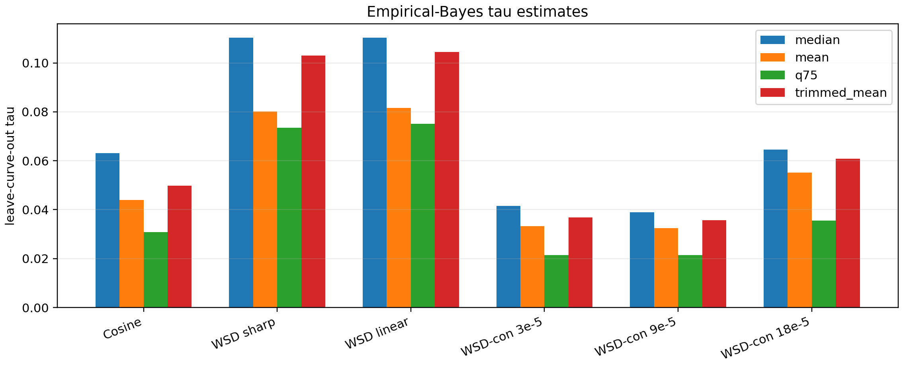
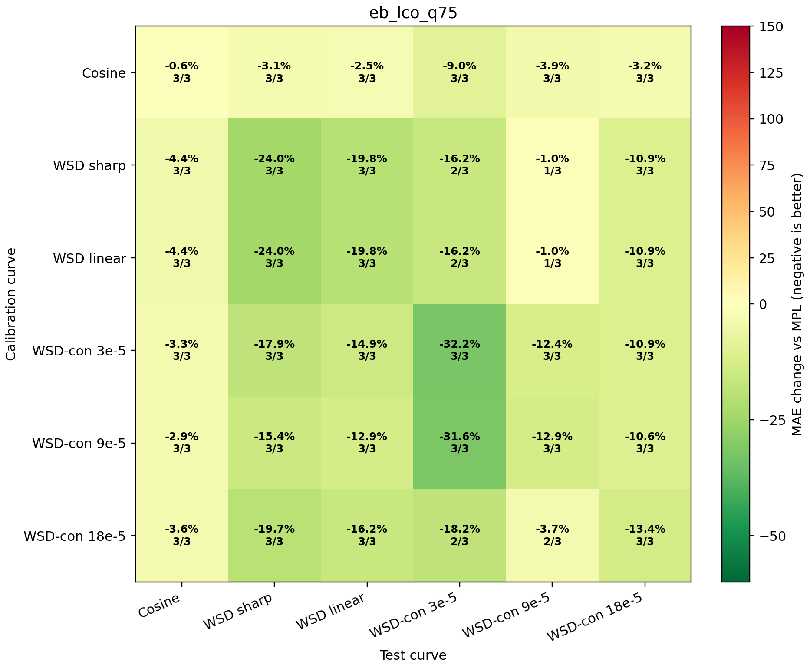

# Empirical-Bayes Kappa Estimator

This report removes the hand-picked fixed `tau` from the MAP/ridge estimator. For each calibration curve, `tau=sigma/k0` is estimated from the other curves only, where `sigma` is a robust residual noise scale and `k0` is the prior susceptibility scale from reliable curves.

## Formula

```text
r = kappa * phi + eps,      eps ~ N(0, sigma^2 I)
kappa ~ N_+(0, k0^2)
w_id = continuous identifiability weight
tau = sigma / k0
kappa_hat = min(0.03, max(0, <phi,r> / (||phi||^2 + tau^2 / w_id)))
```

The added denominator is exactly the MAP ridge penalty. Low-identifiability curves increase the prior precision through `1/w_id`, so trend-like residual alignment is allowed to help only when the curve has enough response information.

## Comparison

| estimator | worst offdiag | median offdiag | mean offdiag | cosine -> WSD | wsdcon_9 -> WSD |
|---|---:|---:|---:|---:|---:|
| `fixed_map_tau_0p03` | -1.0% | -10.9% | -10.9% | -3.3% | -15.4% |
| `eb_lco_q75` | -1.0% | -10.9% | -10.8% | -3.1% | -15.4% |
| `eb_lco_mean` | -1.0% | -10.9% | -10.5% | -1.5% | -15.4% |
| `fixed_map_tau_0p05` | -1.0% | -10.9% | -10.4% | -1.2% | -15.4% |
| `eb_lco_trimmed_mean` | -1.0% | -10.9% | -10.4% | -1.2% | -15.4% |
| `eb_lco_median` | -0.6% | -10.9% | -10.3% | -0.7% | -15.4% |
| `current_smooth_cap` | -0.0% | -10.9% | -10.1% | -0.0% | -15.4% |

## Tau Diagnostics



| estimator | mean tau | min tau | max tau |
|---|---:|---:|---:|
| `eb_lco_median` | 0.0715 | 0.0389 | 0.1104 |
| `eb_lco_mean` | 0.0544 | 0.0324 | 0.0815 |
| `eb_lco_q75` | 0.0430 | 0.0215 | 0.0751 |
| `eb_lco_trimmed_mean` | 0.0651 | 0.0357 | 0.1045 |

## Recommended EB Candidate

Best fixed-tau reference: `fixed_map_tau_0p03`. Recommended data-driven estimator: `eb_lco_q75`.



Interpretation: the fixed `tau=0.03` result is a useful oracle/reference, but the EB estimator recovers a nearby regularization scale without using the held-out calibration curve. For the paper, the EB version is more defensible because `tau=sigma/k0` is estimated from residual noise and reliable susceptibility scale rather than selected by a grid search.
