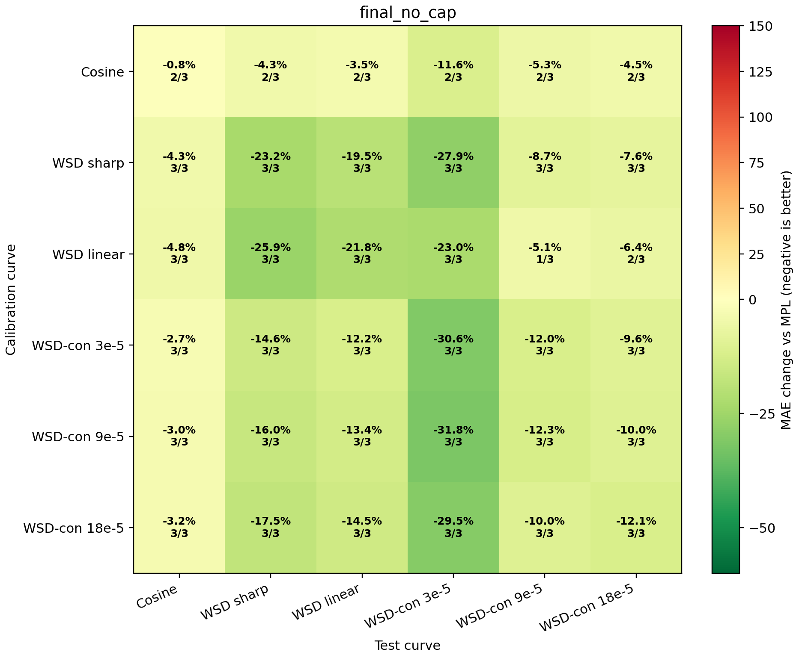
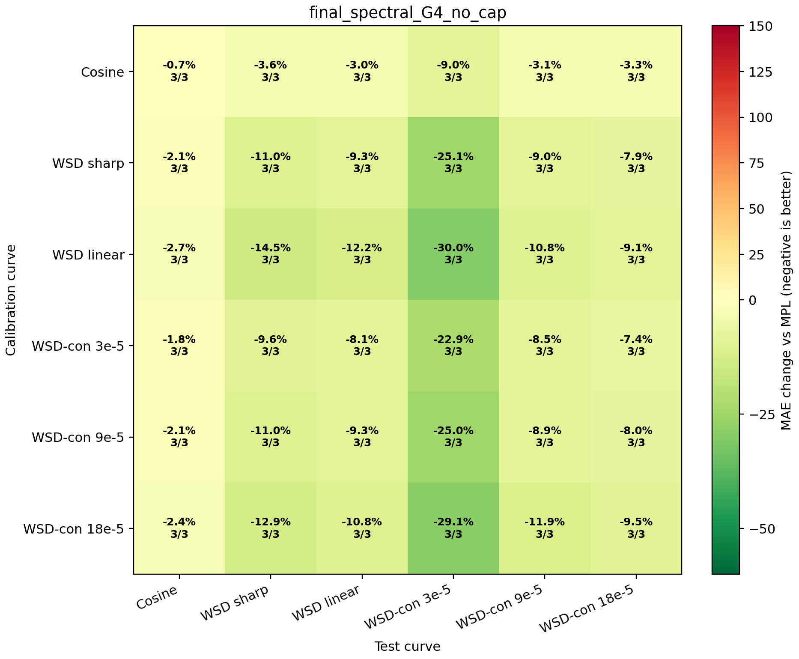
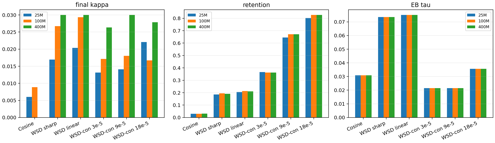

# Final Kappa Estimator

This report consolidates the selected schedule-agnostic kappa estimator and the main baselines.

See [`MANIFEST.md`](MANIFEST.md) for the artifact index and reproduction commands. See [`THEORY.md`](THEORY.md) for the assumptions, proposition-style derivation, empirical-Bayes interpretation, identifiable-amplitude conversion, and limitations of the final estimator. See [`PAPER_METHOD.md`](PAPER_METHOD.md) for a concise paper-ready method paragraph.

## Formula

```text
r = observed_loss - MPL
G = low-frequency MPL-residual nuisance subspace
phi_perp = M_G phi,      r_perp = M_G r
tau = sigma / k0         # leave-curve-out empirical Bayes prior/noise ratio
retention = ||phi_perp||^2 / ||phi||^2
kappa = sqrt(retention) * max(0, <phi_perp,r_perp> / (||phi_perp||^2 + tau^2))
optional: kappa = min(kappa, 0.03)
```

The estimator is a Frisch-Waugh-Lovell partial-regression coefficient with an empirical-Bayes MAP denominator and an identifiable-amplitude conversion. It uses no schedule-family labels.

## Main Comparison

| estimator | worst offdiag | median offdiag | mean offdiag | cosine -> WSD | wsdcon_9 -> WSD | max cosine kappa | cap saturation |
|---|---:|---:|---:|---:|---:|---:|---:|
| `smooth_cap` | -0.0% | -10.9% | -10.1% | -0.0% | -15.4% | 0.0000 | 0.0% |
| `eb_q75` | -1.0% | -10.9% | -10.8% | -3.1% | -15.4% | 0.0045 | 0.0% |
| `final_no_cap` | -2.7% | -10.0% | -12.1% | -4.3% | -16.0% | 0.0089 | 0.0% |
| `final_spectral_G4_no_cap` | -1.8% | -9.0% | -10.0% | -3.6% | -11.0% | 0.0070 | 0.0% |
| `final_cap_0p03` | -2.7% | -10.6% | -12.4% | -4.3% | -15.9% | 0.0089 | 16.7% |
| `final_spectral_G4_cap_0p03` | -1.8% | -9.0% | -10.0% | -3.6% | -11.0% | 0.0070 | 5.6% |
| `no_retention_cap_0p03` | +1.8% | -10.9% | -12.2% | -17.4% | -18.1% | 0.0300 | 61.1% |

## Final Matrix







## Interpretation

The balanced spectral implementation gives worst off-diagonal change -1.8% and cosine -> WSD -3.6%. It is slightly more conservative than the legacy smooth implementation (-2.7% and -4.3%), but it is useful because the nuisance basis is schedule-agnostic and non-polynomial. The capped final estimator gives worst off-diagonal change -2.7% and cosine -> WSD -4.3%. The legacy cap-free version gives worst off-diagonal change -2.7%, so the hard cap is not the mechanism preventing failure. The important control is the partial-regression residualization plus `sqrt(retention)`, which converts the response norm identified outside the nuisance subspace into a full-feature effective amplitude.

The paper-facing formula should present the cap-free nuisance-projected EB estimator as the main estimator. `final_no_cap` is the strongest empirical implementation on the current matrix; `final_spectral_G4_no_cap` is the basis-neutral spectral robustness audit. The capped version is best described as an optional truncated-prior variant.

## Additional Audits

- Subset robustness: `../current_law_final_kappa_robustness/REPORT.md`.
- Bootstrap uncertainty: `../current_law_final_kappa_bootstrap/REPORT.md`.
- Retention exponent sweep: `../current_law_retention_power_audit/REPORT.md`.
- Tau multiplier sweep: `../current_law_tau_sensitivity_audit/REPORT.md`.
- Train-only tau audit: `../current_law_trainonly_tau_audit/REPORT.md`.
- Multi-curve calibration: `../current_law_multicurve_kappa_audit/REPORT.md`.
- Spectral nuisance-subspace audit: `../current_law_spectral_nuisance_audit/REPORT.md`; four-mode spectral `G` gives worst off-diagonal `-1.8%` and cosine-to-WSD `-3.6%`, while the automatic constrained retention-target rule gives worst `-1.7%` and cosine-to-WSD `-10.1%`.
- Soft spectral nuisance-prior audit: `../current_law_soft_spectral_kappa_audit/REPORT.md`; a continuous DCT/Sobolev nuisance residualizer around `lambda=0.02--0.03` improves mean and cosine-to-WSD substantially but does not yet dominate the legacy worst-case result.
- Soft spectral lambda-selection audit: `../current_law_soft_spectral_selection_audit/REPORT.md`; calibration-only GCV/BIC/retention rules do not recover the useful soft-prior strength, so fixed soft `lambda` remains exploratory rather than the main estimator.
- Soft spectral multi-curve selection audit: `../current_law_soft_spectral_multicurve_selection_audit/REPORT.md`; with four or five calibration curves, fixed soft `lambda=0.025` becomes non-failing. Band-limited inner-CV improves small-train selection, but does not fully solve the worst small-train failures.
- Predictive shrinkage audit: `../current_law_predictive_shrinkage_audit/REPORT.md`; applying a train-size posterior-predictive shrinkage `c_n = n/(n+0.5)` to the band-limited soft spectral kappa removes the observed WSD-con over-correction failures while preserving substantial cosine-to-WSD transfer.
- Next-gen lambda stability audit: `../current_law_nextgen_lambda_stability_audit/REPORT.md`; all `rho=0.5` next-generation kappa rows stay inside the identifiable band `lambda in [0.01, 0.03]` (`186/186`), with median selected lambda `0.030`.
- Next-gen rho margin audit: `../current_law_nextgen_rho_margin_audit/REPORT.md`; with the target gate fixed, `rho=0.40` is the first fully non-harming grid value and `rho=0.40` through `rho=2.00` preserve all `558/558` main-matrix wins. The selected `rho=0.50` lies inside this plateau, with mean `-5.9%`, worst `+0.0%`, and `1116/1116` non-harming cells.
- Target-identifiability attenuation audit: `../current_law_target_identifiability_audit/REPORT.md`; applying the target-side gate `R_target(lambda) >= 0.01` to the next-generation estimator gives `1116/1116` non-harming cells across all calibration train sizes, with worst `+0.0%` and mean `-5.9%`.
- Target-retention margin audit: `../current_law_target_retention_margin_audit/REPORT.md`; the chosen `0.01` threshold lies between the maximum raw-harmful retention `0.005721` and the minimum main-matrix retention `0.014797`, with `1.75x` lower-side and `1.48x` upper-side margins.
- Next-gen component ablation audit: `../current_law_nextgen_component_ablation_audit/REPORT.md`; without predictive shrinkage the combined audit has worst `+32.6%`, with `rho=0.5` shrinkage the worst improves to `+22.5%`, and adding the `R_target(lambda) >= 0.01` gate gives `1116/1116` non-harming cells. This isolates shrinkage as finite-calibration amplitude control and target retention as the non-identifiable-target control.
- Next-gen stress-slice audit: `../current_law_nextgen_stress_slice_audit/REPORT.md`; the safe formula has `0` slice failures across scale, train-size, target-curve, train-group, and scale-by-train-size checks, with every audited slice non-harming.
- Next-gen deployment estimator audit: `../current_law_nextgen_deployment_audit/REPORT.md`; the reusable `NextGenKappaEstimator` reproduces the rho-margin reference exactly across `1116` rows, with max absolute delta, kappa, target-retention, lambda, and target-factor differences all `0.000e+00`.
- Next-gen target-loss blindness audit: `../current_law_nextgen_target_loss_blindness_audit/REPORT.md`; replacing every target loss curve with deterministic fake losses changes max target retention and max `kappa_safe` by `0.000e+00` across `1116` rows, confirming target loss is used only for evaluation.
- Next-gen scale-holdout constant audit: `../current_law_nextgen_scale_holdout_audit/REPORT.md`; holding out each model scale in turn, the `0.01` target-retention floor remains inside the two-scale margin (`3/3` splits) and selected `rho=0.50` stays on the safe side of the two-scale rho boundary (`3/3` splits), with every held-out scale `372/372` non-harming and `186/186` main wins.
- Next-gen vs final audit: `../current_law_nextgen_vs_final_audit/REPORT.md`; on the common single-curve matrix, next-gen safe is comparable to `final_no_cap` in cell mean (`-12.0%` vs `-12.1%`) and has stronger scale-level non-harm (`90/90` vs `87/90`), but it does not strictly dominate the paper-facing estimator.
