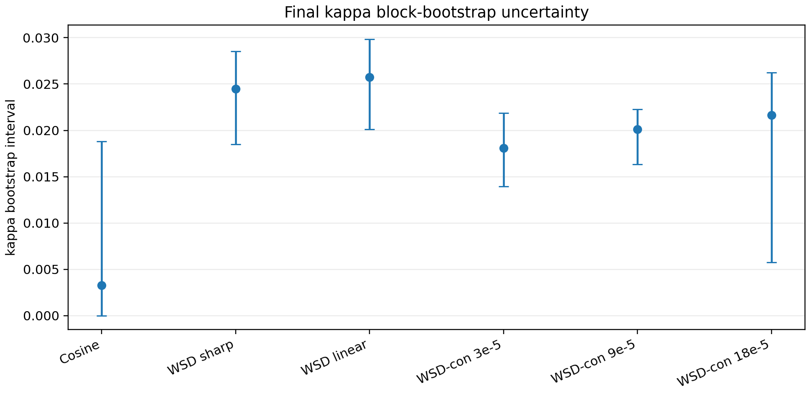

# Final Kappa Bootstrap Uncertainty

Block bootstrap with `80` replicates and `24` contiguous blocks per calibration curve.

| train curve | mean full kappa | mean boot kappa | mean p05 | mean p95 | zero rate | cap rate |
|---|---:|---:|---:|---:|---:|---:|
| Cosine | 0.0050 | 0.0061 | 0.0000 | 0.0188 | 36.2% | 0.8% |
| WSD sharp | 0.0246 | 0.0239 | 0.0185 | 0.0285 | 0.8% | 42.1% |
| WSD linear | 0.0266 | 0.0252 | 0.0201 | 0.0299 | 0.0% | 44.2% |
| WSD-con 3e-5 | 0.0189 | 0.0180 | 0.0139 | 0.0219 | 0.0% | 2.5% |
| WSD-con 9e-5 | 0.0207 | 0.0196 | 0.0163 | 0.0223 | 0.4% | 17.1% |
| WSD-con 18e-5 | 0.0222 | 0.0201 | 0.0058 | 0.0262 | 7.1% | 11.7% |

## Reading

The bootstrap intervals quantify estimator uncertainty after preserving local time structure through block resampling. Wide intervals indicate that the calibration curve contains limited identifiable response information; cap-rate and zero-rate expose whether the estimator is prior-dominated. Cosine has a wide interval including zero, matching the theory that diffuse schedules weakly identify the DropRelaxS amplitude. WSD and most WSD-con curves have tighter positive intervals, supporting the claim that their response amplitude is genuinely identifiable.
