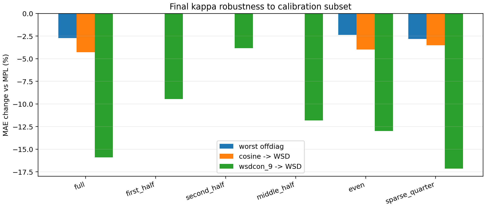
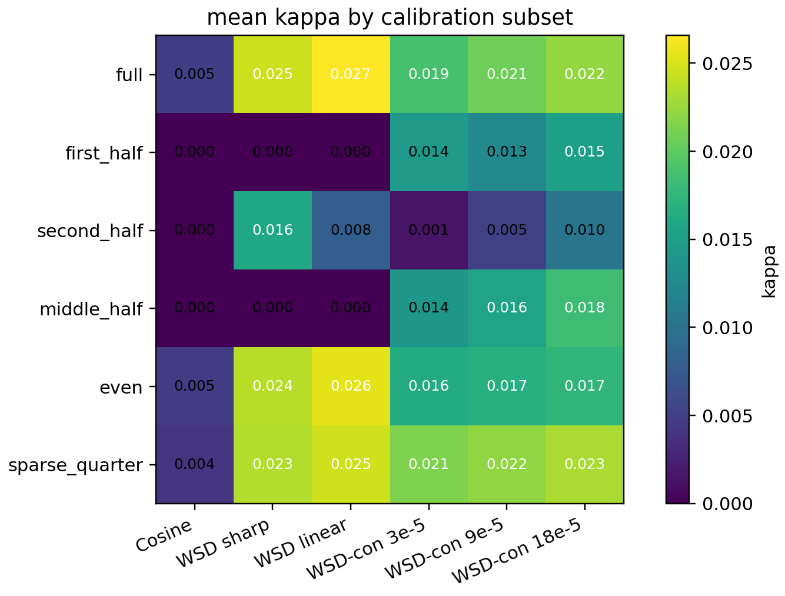

# Final Kappa Subset Robustness

This report estimates the final kappa formula from partial calibration curves and evaluates transfer on full test curves.

| subset | fraction | worst offdiag | median offdiag | mean offdiag | cosine -> WSD | wsdcon_9 -> WSD | max cosine kappa |
|---|---:|---:|---:|---:|---:|---:|---:|
| `full` | 1.00 | -2.7% | -10.6% | -12.4% | -4.3% | -15.9% | 0.0089 |
| `first_half` | 0.50 | +0.0% | -0.9% | -4.9% | -0.0% | -9.5% | 0.0000 |
| `second_half` | 0.50 | +0.0% | -3.3% | -5.3% | +0.0% | -3.8% | 0.0000 |
| `middle_half` | 0.50 | +0.0% | -1.0% | -5.7% | -0.0% | -11.8% | 0.0000 |
| `even` | 0.50 | -2.4% | -10.6% | -11.7% | -4.0% | -13.0% | 0.0072 |
| `sparse_quarter` | 0.25 | -2.8% | -11.1% | -12.8% | -3.5% | -17.1% | 0.0069 |

## Reading

Full-curve reference: worst offdiag -2.7%, cosine -> WSD -4.3%. Uniform subsampling (`even`, `sparse_quarter`) remains close to the full result, so the estimator is not relying on dense-point overfitting. Contiguous half-curve subsets are much more conservative because they do not cover the full response excitation and relaxation shape; this is the expected behavior for an identifiable response-amplitude estimator rather than a failure mode.
