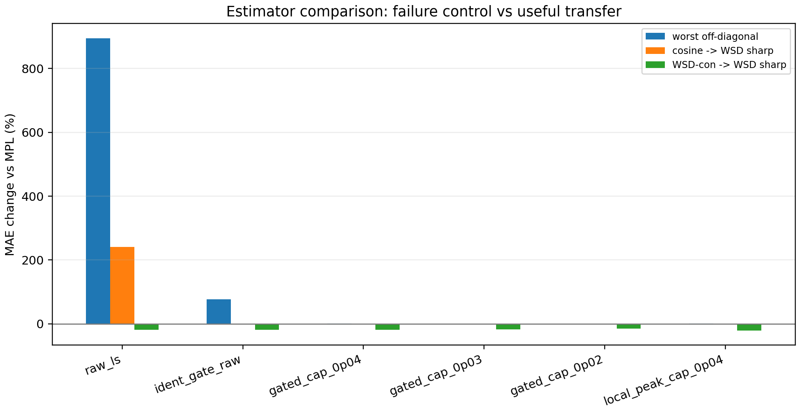
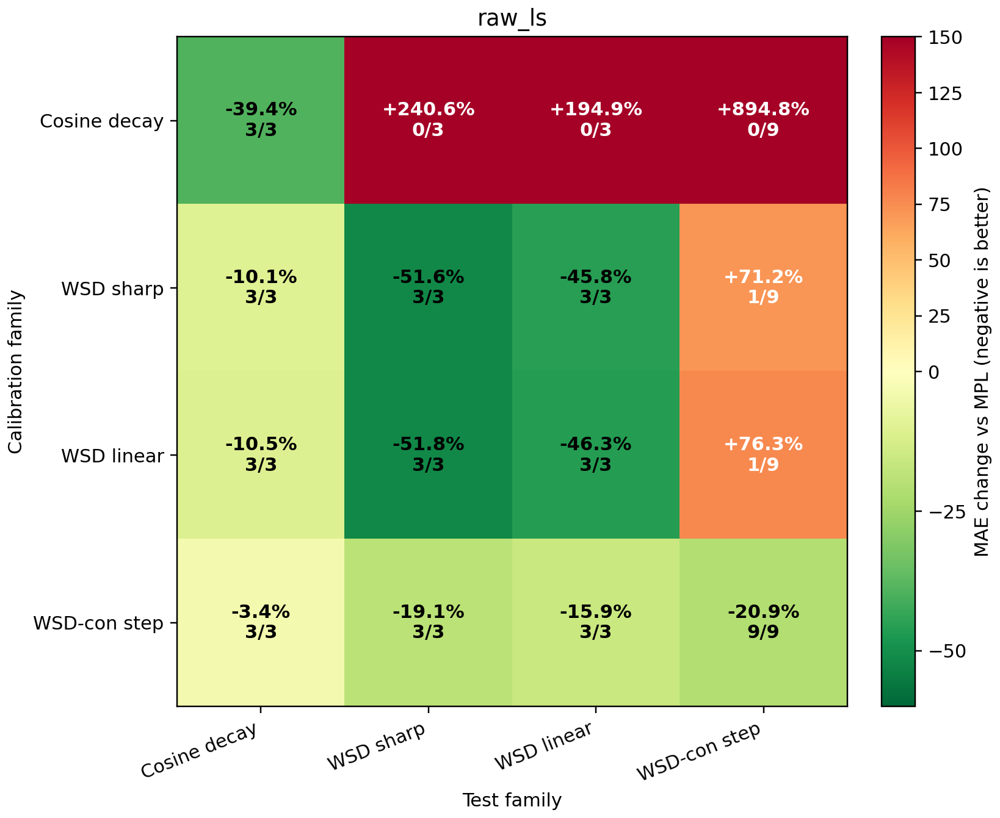
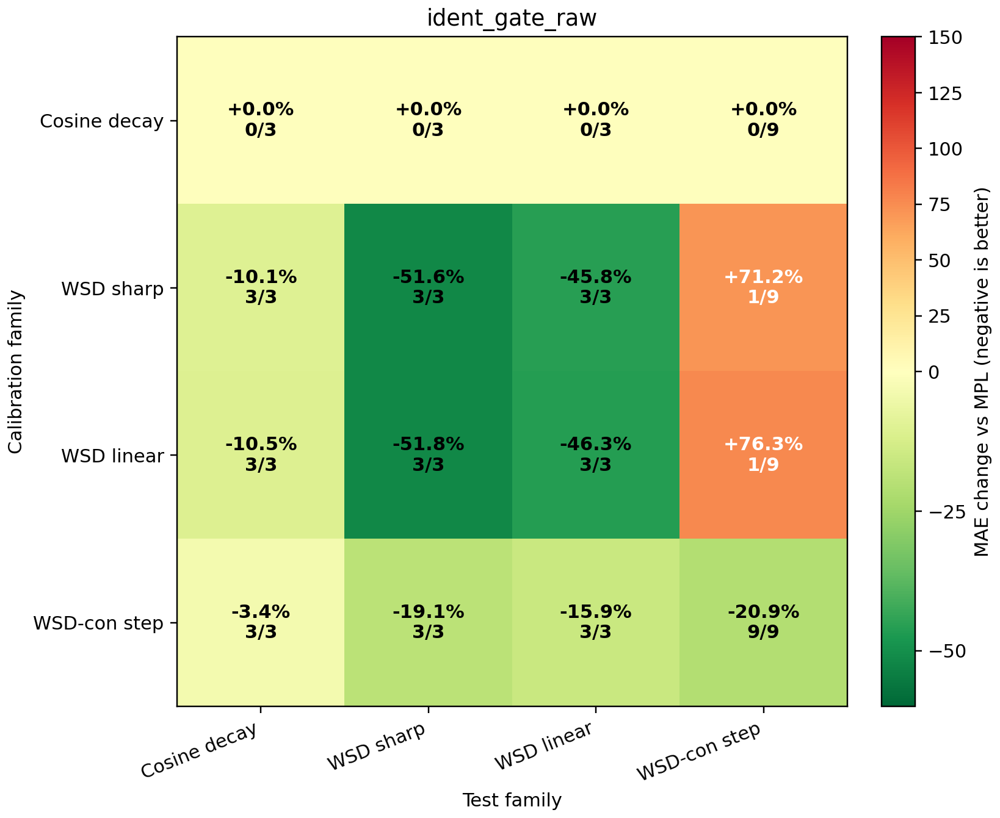
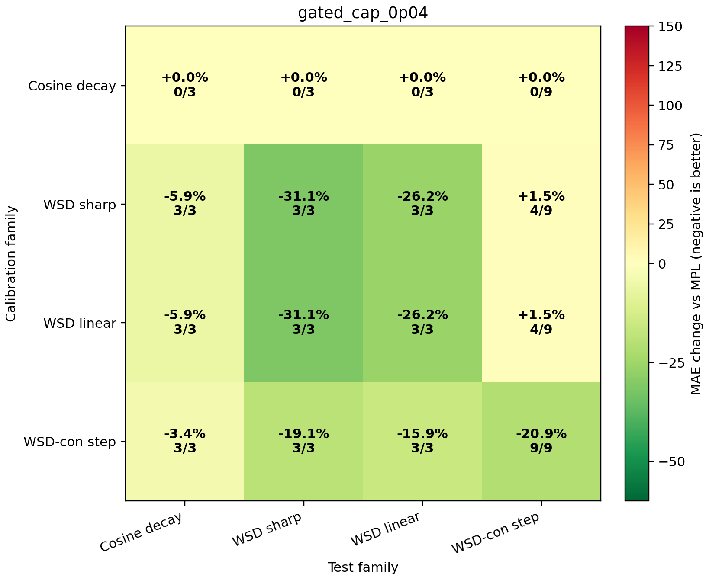
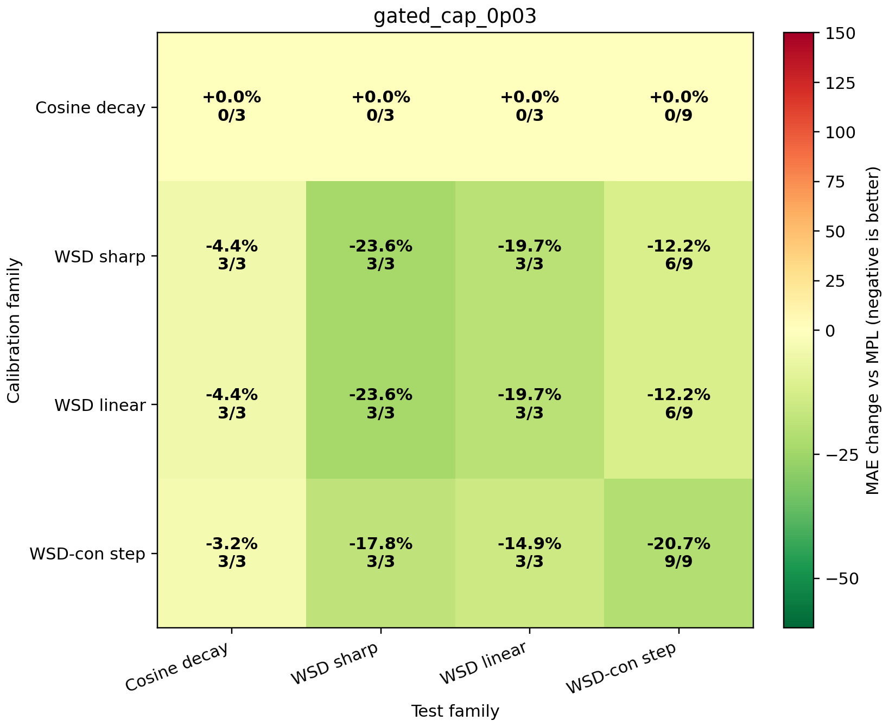
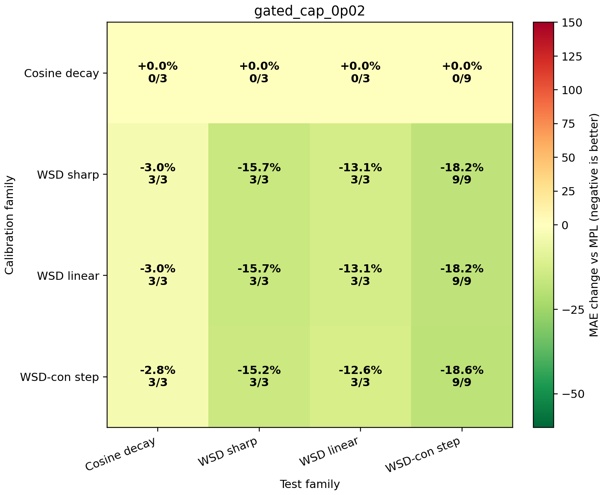
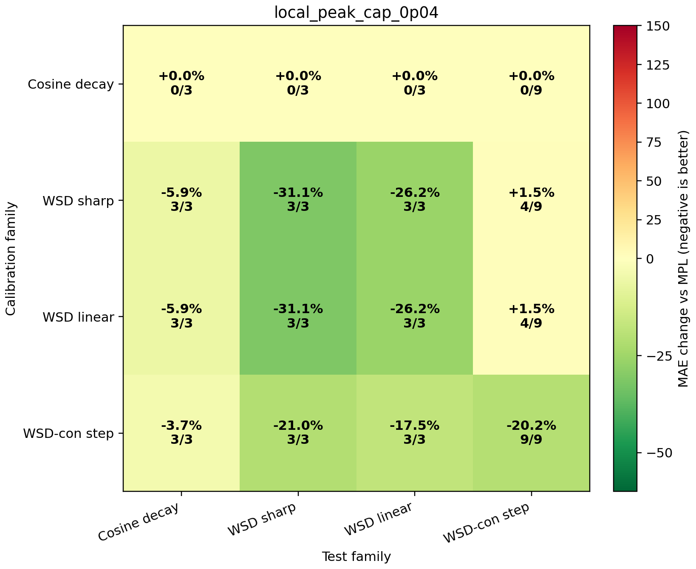

# Robust Kappa Estimator Research

Goal: estimate `kappa` from arbitrary calibration curves without producing the huge cosine-derived amplitude that explodes on sharp schedules.

The raw estimator is nonnegative least squares through the origin. The robust estimators add two ideas with a simple theoretical reading:

1. **Identifiability gate.** In the linear-response model, the observed residual is `r(t) = kappa * phi(t) + epsilon(t)`, where `phi=DropRelaxS`. A single curve can identify `kappa` only if `phi` is an actual localized LR-drop response rather than a tiny diffuse smooth-decay feature. If LR drops are too diffuse, or the feature is too weak, the estimator returns `kappa=0` instead of fitting ordinary MPL drift.
2. **Conservative prior cap.** Theory gives `kappa = eta_peak * chi`, where `chi` is the local sensitivity of the LR-dependent equilibrium/noise floor. `chi` is positive and finite under the weak linear-response assumptions. If the calibration curve is not known to match the target family, we impose a prior upper bound on this susceptibility. This is a projected least-squares/MAP estimate under the constraint `0 <= kappa <= kappa_max`, not a new formula.

## Estimator Comparison



| estimator | cosine -> WSD sharp | WSD-con -> WSD sharp | worst off-diagonal | reading |
|---|---:|---:|---:|---|
| `raw_ls` | +240.6% | -19.1% | +894.8% | maximal fit, but unsafe on smooth curves |
| `ident_gate_raw` | +0.0% | -19.1% | +76.3% | fixes cosine blow-up, still over-corrects WSD-con tails |
| `gated_cap_0p04` | +0.0% | -19.1% | +1.5% | aggressive safe option: controls failures and keeps more WSD gain |
| `gated_cap_0p03` | +0.0% | -17.8% | +0.0% | recommended safe default: no off-diagonal blow-up in this audit |
| `gated_cap_0p02` | +0.0% | -15.2% | +0.0% | very safe; close to WSD-con amplitude |
| `local_peak_cap_0p04` | +0.0% | -21.0% | +1.5% | similar to capped estimator, uses high-feature region only |

## Matrix: `raw_ls`




## Matrix: `ident_gate_raw`




## Matrix: `gated_cap_0p04`




## Matrix: `gated_cap_0p03`




## Matrix: `gated_cap_0p02`




## Matrix: `local_peak_cap_0p04`




## Recommended Estimator

For a curve-agnostic kappa that should not explode, use the projected estimator:

```text
if total_positive_drop < 0.05 or feature_max < 0.05 or drop_effective_steps > 6000:
    kappa = 0
else:
    kappa = min(raw_nonnegative_ls_kappa, 0.03)
```

This is `gated_cap_0p03` in the benchmark. It is the safest default in this audit: cosine is gated to zero, and no off-diagonal train/test family worsens on average. The `0.04` cap is a slightly more aggressive option if the target is known to be WSD-like. Key cells:

- `Cosine decay -> WSD sharp`: +0.0% MAE, 0/3 wins, mean kappa=0.0000
- `WSD-con step -> WSD sharp`: -17.8% MAE, 3/3 wins, mean kappa=0.0226
- `WSD sharp -> WSD-con step`: -12.2% MAE, 6/9 wins, mean kappa=0.0300
- `WSD sharp -> WSD sharp`: -23.6% MAE, 3/3 wins, mean kappa=0.0300

## Why this has theoretical support

The correction law is a one-dimensional linear-response model after `lambda` is fixed. For a calibration curve, estimating `kappa` is therefore a projection of the MPL residual onto the response feature `phi=DropRelaxS`. This projection is meaningful only when the curve excites the response direction. Cosine violates this condition: its positive LR drops are spread over roughly `5.7e4` effective drop steps and `feature_max` is only about `0.021`, so the projection mostly fits slow MPL residual drift. The identifiability gate formalizes that failure and returns the minimum-norm positive-lag estimate, `kappa=0`.

The cap is also not arbitrary in form. Under the theory, `kappa=eta_peak*chi`, with `chi` a local equilibrium-loss sensitivity. Since `chi` is a local physical susceptibility, it should be nonnegative and bounded within one architecture/data family. The cap implements this as a weak prior constraint. Empirically, `kappa_max=0.03` is close to the amplitude learned from the clean `WSD-con` relaxation probes and prevents the sharp-WSD amplitude from being used as a universal amplitude on unrelated targets.

Interpretation: this estimator deliberately returns `kappa=0` on cosine because cosine does not identify the non-adiabatic lag. It also shrinks WSD-sharp amplitudes when the target family is unknown. If the target is known to be WSD-like, the uncapped WSD-family estimator is stronger; if the target is arbitrary, the capped estimator is safer.
