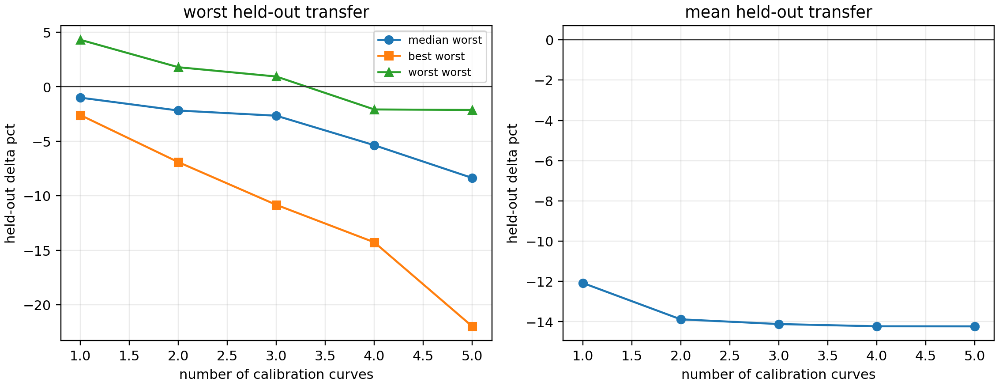

# Multi-Curve Kappa Calibration Audit

This audit extends the final cap-free estimator to multiple calibration curves by concatenating the nuisance-projected regression problems. For each train subset, `tau` is estimated from the training curves only, and evaluation is performed only on held-out curves.

```text
dot_S = sum_c <M_G phi_c, M_G r_c>
l2_S = sum_c ||M_G phi_c||^2
full_l2_S = sum_c ||phi_c||^2
kappa_S = sqrt(l2_S / full_l2_S) * max(0, dot_S / (l2_S + tau^2))
```



## Train-Size Summary

| train curves | subsets | median worst heldout | best worst heldout | worst worst heldout | mean heldout |
|---:|---:|---:|---:|---:|---:|
| 1 | 6 | -1.0% | -2.6% | +4.3% | -12.1% |
| 2 | 15 | -2.2% | -6.9% | +1.8% | -13.9% |
| 3 | 20 | -2.7% | -10.8% | +0.9% | -14.1% |
| 4 | 15 | -5.4% | -14.3% | -2.1% | -14.2% |
| 5 | 6 | -8.4% | -22.0% | -2.1% | -14.2% |

## Best Subset By Train Size

| train curves | best subset | worst heldout | mean heldout | max kappa |
|---:|---|---:|---:|---:|
| 1 | WSD-con 18e-5 | -2.6% | -14.9% | 0.0277 |
| 2 | Cosine + WSD-con 9e-5 | -6.9% | -17.2% | 0.0285 |
| 3 | Cosine + WSD-con 9e-5 + WSD-con 18e-5 | -10.8% | -20.3% | 0.0292 |
| 4 | Cosine + WSD linear + WSD-con 9e-5 + WSD-con 18e-5 | -14.3% | -24.6% | 0.0314 |
| 5 | Cosine + WSD sharp + WSD linear + WSD-con 9e-5 + WSD-con 18e-5 | -22.0% | -32.6% | 0.0333 |

## Reading

The pooled estimator is the same formula as the single-curve estimator, with inner products and norms summed over calibration curves. This gives a principled way to use more calibration data without introducing schedule-family labels.

The audit should be read as a calibration-coverage test. Larger train sets reduce dependence on any single response shape, but they can also average together curves whose residual response amplitudes differ. The useful question is therefore not whether every pooled subset is better, but whether the formula remains stable and whether well-covered train sets improve held-out transfer without a hard cap.
