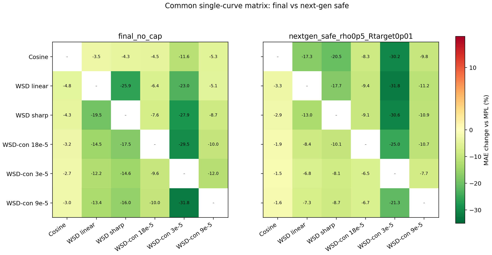
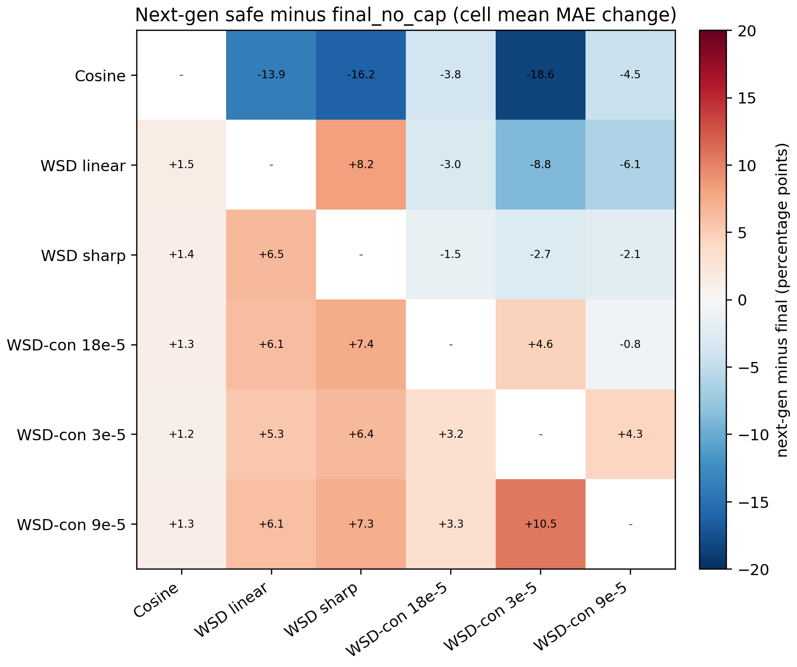

# Next-Gen vs Final Kappa Audit

This audit compares the paper-facing `final_no_cap` estimator with the next-generation safe estimator on the common six-schedule, single-curve off-diagonal matrix.

## Summary

| method | cell mean | worst cell | winning cells | scale mean | worst scale | non-harm scale rows |
|---|---:|---:|---:|---:|---:|---:|
| `final_no_cap` | -12.1% | -2.7% | 30/30 | -12.1% | +2.5% | 87/90 |
| `nextgen_safe_rho0p5_Rtarget0p01` | -12.0% | -1.5% | 30/30 | -12.0% | -1.0% | 90/90 |

## Key Transfers

| method | train -> test | mean delta | worst scale | scale wins |
|---|---|---:|---:|---:|
| `final_no_cap` | Cosine -> WSD sharp | -4.3% | +0.0% | 2/3 |
| `final_no_cap` | WSD-con 9e-5 -> WSD sharp | -16.0% | -12.9% | 3/3 |
| `final_no_cap` | WSD linear -> WSD sharp | -25.9% | -18.6% | 3/3 |
| `nextgen_safe_rho0p5_Rtarget0p01` | Cosine -> WSD sharp | -20.5% | -12.5% | 3/3 |
| `nextgen_safe_rho0p5_Rtarget0p01` | WSD-con 9e-5 -> WSD sharp | -8.7% | -6.4% | 3/3 |
| `nextgen_safe_rho0p5_Rtarget0p01` | WSD linear -> WSD sharp | -17.7% | -11.7% | 3/3 |

## Readout

On the cell-mean matrix, next-gen safe is comparable to the final estimator: mean `-12.0%` versus `-12.1%`, and both improve all `30/30` off-diagonal cells. The final estimator has the stronger worst cell (`-2.7%` versus `-1.5%`), while next-gen safe has stronger scale-level non-harm (`90/90`). Paired by train/test cell, next-gen is better on `12/30` cells, so this is not a strict dominance result.

The practical difference is directional: next-gen safe is much stronger for Cosine -> WSD sharp, while the final estimator is stronger on some WSD-con -> WSD transfers. This supports presenting next-gen as the best current research extension, not as a replacement for the conservative paper-facing estimator.
