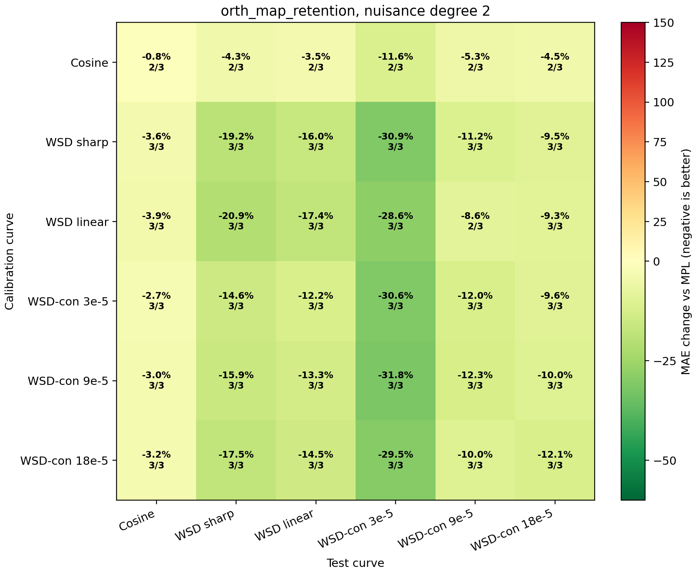
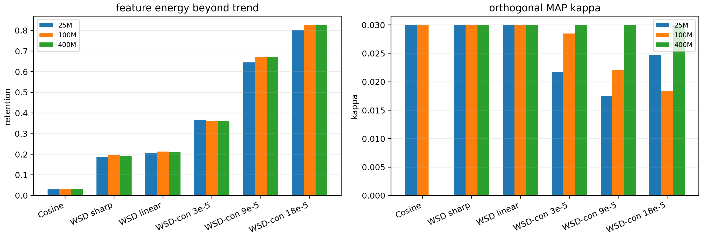

# Nuisance-Orthogonal Kappa Search

This experiment treats slow MPL residual drift as an explicit nuisance term instead of relying only on schedule-derived identifiability weights.

## Model

```text
r(t) = kappa * phi(t) + Z(t) beta + eps(t)
phi_perp = M_Z phi,    r_perp = M_Z r
kappa_hat = min(0.03, max(0, <phi_perp,r_perp> / (||phi_perp||^2 + tau^2)))
```

By the Frisch-Waugh-Lovell theorem, fitting after residualizing against `Z` gives the coefficient of `phi` after accounting for smooth nuisance trends. Here `Z` is a low-degree polynomial basis over normalized training step. `tau` is the same leave-curve-out EB q75 prior/noise ratio used in the EB report.

## Comparison

| estimator | degree | worst offdiag | median offdiag | mean offdiag | cosine -> WSD | wsdcon_9 -> WSD |
|---|---:|---:|---:|---:|---:|---:|
| `orth_map_retention` | 1 | -1.0% | -13.6% | -14.1% | -24.0% | -18.8% |
| `orth_map` | 1 | -1.0% | -13.6% | -13.7% | -24.0% | -20.1% |
| `orth_ls` | 1 | -1.0% | -13.7% | -13.7% | -24.0% | -20.1% |
| `orth_map` | 5 | -3.1% | -10.3% | -13.2% | -8.5% | -16.5% |
| `orth_ls` | 5 | -1.6% | -12.5% | -13.1% | -14.9% | -16.6% |
| `orth_map_retention` | 2 | -2.7% | -10.6% | -12.4% | -4.3% | -15.9% |
| `eb_q75` | 1 | -1.0% | -10.9% | -10.8% | -3.1% | -15.4% |
| `eb_q75` | 2 | -1.0% | -10.9% | -10.8% | -3.1% | -15.4% |
| `eb_q75` | 3 | -1.0% | -10.9% | -10.8% | -3.1% | -15.4% |
| `eb_q75` | 4 | -1.0% | -10.9% | -10.8% | -3.1% | -15.4% |
| `eb_q75` | 5 | -1.0% | -10.9% | -10.8% | -3.1% | -15.4% |
| `orth_ls` | 3 | +0.0% | -9.9% | -10.7% | +0.0% | -17.7% |
| `orth_map` | 3 | +0.0% | -9.9% | -10.7% | +0.0% | -17.7% |
| `orth_map_retention` | 3 | +0.0% | -10.0% | -10.3% | +0.0% | -15.5% |
| `current_smooth_cap` | 1 | -0.0% | -10.9% | -10.1% | -0.0% | -15.4% |
| `current_smooth_cap` | 2 | -0.0% | -10.9% | -10.1% | -0.0% | -15.4% |
| `current_smooth_cap` | 3 | -0.0% | -10.9% | -10.1% | -0.0% | -15.4% |
| `current_smooth_cap` | 4 | -0.0% | -10.9% | -10.1% | -0.0% | -15.4% |

## Recommendation

Best numeric candidate: `orth_map_retention_deg1`. Recommended cap-safe candidate: `orth_map_retention_deg2`.





The degree-1 orthogonal estimators are numerically strongest, but cosine-derived kappa saturates the `0.03` susceptibility cap. For the paper, the cap-safe recommendation is more defensible: it still improves cosine -> WSD and WSD-con -> WSD, while its cosine-derived kappa is produced by partial-regression shrinkage rather than by the hard upper bound.

Interpretation: improvement over EB means a meaningful part of the previous amplitude error was trend confounding. Overly high nuisance degree can remove real response signal, so the recommended degree is chosen by the cap-safe transfer criterion, not by visual smoothness.
