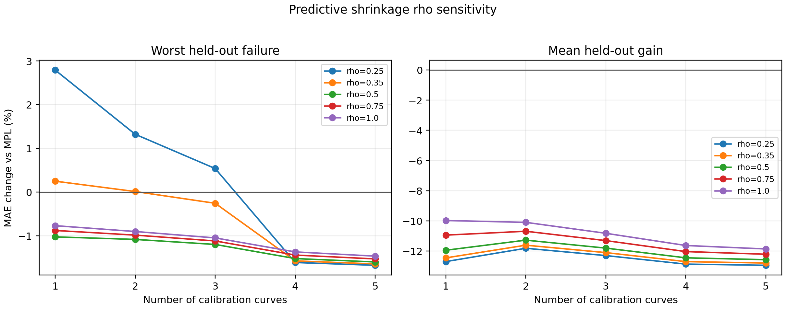
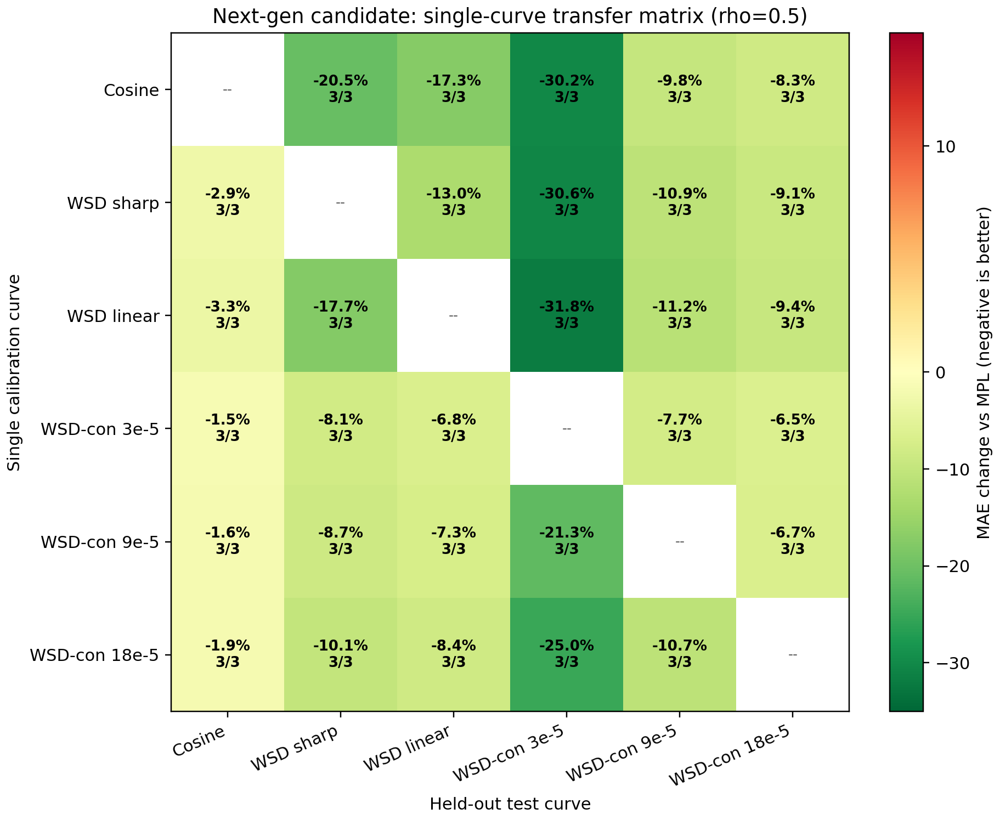
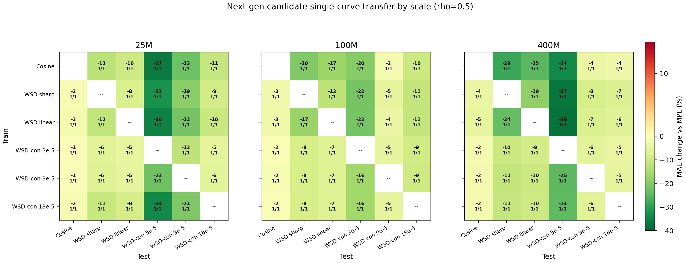
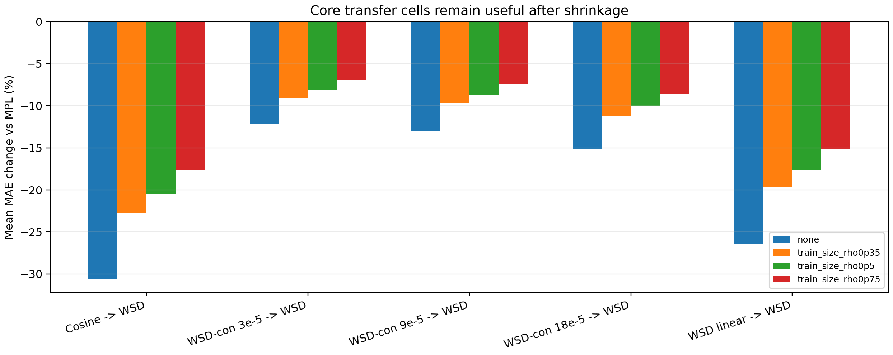

# Predictive Shrinkage Audit

This audit starts from the soft spectral `inner_cv_band_mean` kappa and tests whether a train-only amplitude shrinkage can reduce held-out over-correction. The estimator direction, nuisance residualization, lambda selection, and tau estimation are unchanged; only the final transferable amplitude is multiplied by a scalar shrinkage factor.

Implementation note: all loss curves, MPL baselines, and response features are cached before scoring, so the rho sweep and inner-CV selector are reproducible lightweight matrix evaluations rather than repeated curve fitting.

## Candidate Shrinkage Rules

- `none`: original band-limited soft spectral kappa.
- `constant_0p85`: diagnostic reference suggested by the held-out shape of the over-correction failure.
- `train_size_rho0p25`: `c_n = n/(n+0.25)`, a weak posterior-predictive shrinkage rule.
- `train_size_rho0p35`: `c_n = n/(n+0.35)`, a finite-calibration posterior-predictive shrinkage rule.
- `train_size_rho0p5`: stronger version, `c_n = n/(n+0.5)`.
- `train_size_rho0p75` and `train_size_rho1p0`: stronger sensitivity checks.
- `train_selected_rho`: rho selected by true leave-one-curve-out transfer inside the training curves; for one-curve calibration it falls back to the fixed `rho=0.5` prior because no inner split exists.

## Train-Size Summary

| candidate | train curves | median worst heldout | best worst heldout | worst worst heldout | mean heldout | median shrink |
|---|---:|---:|---:|---:|---:|---:|
| `none` | 1 | -0.7% | -2.3% | +13.2% | -12.4% | 1.000 |
| `none` | 2 | -1.6% | -6.2% | +5.6% | -12.2% | 1.000 |
| `none` | 3 | -2.2% | -8.9% | +3.3% | -12.8% | 1.000 |
| `none` | 4 | -5.5% | -12.1% | -1.7% | -13.3% | 1.000 |
| `none` | 5 | -7.4% | -22.0% | -1.8% | -13.3% | 1.000 |
| `constant_0p85` | 1 | -1.3% | -2.1% | +5.0% | -12.8% | 0.850 |
| `constant_0p85` | 2 | -1.4% | -5.4% | -0.0% | -11.6% | 0.850 |
| `constant_0p85` | 3 | -2.0% | -7.5% | -1.2% | -11.8% | 0.850 |
| `constant_0p85` | 4 | -5.6% | -10.3% | -1.5% | -12.1% | 0.850 |
| `constant_0p85` | 5 | -6.5% | -21.2% | -1.5% | -12.0% | 0.850 |
| `train_size_rho0p25` | 1 | -1.5% | -2.0% | +2.8% | -12.7% | 0.800 |
| `train_size_rho0p25` | 2 | -1.5% | -5.6% | +1.3% | -11.8% | 0.889 |
| `train_size_rho0p25` | 3 | -2.2% | -8.2% | +0.5% | -12.3% | 0.923 |
| `train_size_rho0p25` | 4 | -5.6% | -11.4% | -1.6% | -12.9% | 0.941 |
| `train_size_rho0p25` | 5 | -7.1% | -21.9% | -1.7% | -12.9% | 0.952 |
| `train_size_rho0p35` | 1 | -1.5% | -2.2% | +0.2% | -12.5% | 0.741 |
| `train_size_rho0p35` | 2 | -1.4% | -5.4% | +0.0% | -11.6% | 0.851 |
| `train_size_rho0p35` | 3 | -2.1% | -8.0% | -0.3% | -12.1% | 0.896 |
| `train_size_rho0p35` | 4 | -5.6% | -11.2% | -1.6% | -12.7% | 0.920 |
| `train_size_rho0p35` | 5 | -7.0% | -21.8% | -1.6% | -12.8% | 0.935 |
| `train_size_rho0p5` | 1 | -1.6% | -2.2% | -1.0% | -12.0% | 0.667 |
| `train_size_rho0p5` | 2 | -1.5% | -5.4% | -1.1% | -11.3% | 0.800 |
| `train_size_rho0p5` | 3 | -2.0% | -7.6% | -1.2% | -11.8% | 0.857 |
| `train_size_rho0p5` | 4 | -5.6% | -10.8% | -1.5% | -12.5% | 0.889 |
| `train_size_rho0p5` | 5 | -6.9% | -21.6% | -1.6% | -12.6% | 0.909 |
| `train_size_rho0p75` | 1 | -1.4% | -4.1% | -0.9% | -10.9% | 0.571 |
| `train_size_rho0p75` | 2 | -1.6% | -5.3% | -1.0% | -10.7% | 0.727 |
| `train_size_rho0p75` | 3 | -2.3% | -7.1% | -1.1% | -11.3% | 0.800 |
| `train_size_rho0p75` | 4 | -5.6% | -10.2% | -1.4% | -12.0% | 0.842 |
| `train_size_rho0p75` | 5 | -6.6% | -21.4% | -1.5% | -12.2% | 0.870 |
| `train_size_rho1p0` | 1 | -1.2% | -5.1% | -0.8% | -10.0% | 0.500 |
| `train_size_rho1p0` | 2 | -1.5% | -5.0% | -0.9% | -10.1% | 0.667 |
| `train_size_rho1p0` | 3 | -2.7% | -6.7% | -1.0% | -10.8% | 0.750 |
| `train_size_rho1p0` | 4 | -5.6% | -9.7% | -1.4% | -11.6% | 0.800 |
| `train_size_rho1p0` | 5 | -6.4% | -21.1% | -1.5% | -11.9% | 0.833 |
| `train_selected_rho` | 1 | -1.6% | -2.2% | -1.0% | -12.0% | 0.667 |
| `train_selected_rho` | 2 | -1.5% | -5.5% | +5.6% | -11.2% | 0.952 |
| `train_selected_rho` | 3 | -1.9% | -8.9% | +3.3% | -12.3% | 1.000 |
| `train_selected_rho` | 4 | -5.5% | -12.1% | -1.5% | -13.0% | 1.000 |
| `train_selected_rho` | 5 | -7.4% | -22.0% | -1.5% | -13.3% | 1.000 |

## Single-Curve Transfer Matrix

This is the complete off-diagonal train/test matrix for the next-generation candidate with one calibration curve and fixed `rho=0.5`. The worst mean off-diagonal cell is `-1.5%`, and the mean off-diagonal change is `-12.0%`.

The same single-curve matrix is also checked separately at each model scale. Across all scale-specific off-diagonal cells, the worst cell is `-1.0%` with `0` non-improving cells.

## Key Transfer Cells

These cells check that predictive shrinkage is not merely turning the correction off. The core cosine-to-WSD and WSD-con-to-WSD transfers remain useful under `rho=0.5`.

| candidate | train -> test | mean delta | worst delta | wins | mean kappa | mean shrink |
|---|---|---:|---:|---:|---:|---:|
| `none` | Cosine -> WSD sharp | -30.7% | -18.8% | 3/3 | 0.0409 | 1.000 |
| `none` | WSD-con 3e-5 -> WSD sharp | -12.2% | -9.2% | 3/3 | 0.0159 | 1.000 |
| `none` | WSD-con 9e-5 -> WSD sharp | -13.0% | -9.6% | 3/3 | 0.0171 | 1.000 |
| `none` | WSD-con 18e-5 -> WSD sharp | -15.1% | -12.3% | 3/3 | 0.0193 | 1.000 |
| `none` | WSD linear -> WSD sharp | -26.5% | -17.5% | 3/3 | 0.0350 | 1.000 |
| `train_size_rho0p35` | Cosine -> WSD sharp | -22.8% | -13.9% | 3/3 | 0.0303 | 0.741 |
| `train_size_rho0p35` | WSD-con 3e-5 -> WSD sharp | -9.1% | -6.8% | 3/3 | 0.0118 | 0.741 |
| `train_size_rho0p35` | WSD-con 9e-5 -> WSD sharp | -9.7% | -7.1% | 3/3 | 0.0127 | 0.741 |
| `train_size_rho0p35` | WSD-con 18e-5 -> WSD sharp | -11.2% | -9.1% | 3/3 | 0.0143 | 0.741 |
| `train_size_rho0p35` | WSD linear -> WSD sharp | -19.6% | -13.0% | 3/3 | 0.0259 | 0.741 |
| `train_size_rho0p5` | Cosine -> WSD sharp | -20.5% | -12.5% | 3/3 | 0.0272 | 0.667 |
| `train_size_rho0p5` | WSD-con 3e-5 -> WSD sharp | -8.1% | -6.1% | 3/3 | 0.0106 | 0.667 |
| `train_size_rho0p5` | WSD-con 9e-5 -> WSD sharp | -8.7% | -6.4% | 3/3 | 0.0114 | 0.667 |
| `train_size_rho0p5` | WSD-con 18e-5 -> WSD sharp | -10.1% | -8.2% | 3/3 | 0.0129 | 0.667 |
| `train_size_rho0p5` | WSD linear -> WSD sharp | -17.7% | -11.7% | 3/3 | 0.0233 | 0.667 |
| `train_size_rho0p75` | Cosine -> WSD sharp | -17.6% | -10.7% | 3/3 | 0.0233 | 0.571 |
| `train_size_rho0p75` | WSD-con 3e-5 -> WSD sharp | -7.0% | -5.3% | 3/3 | 0.0091 | 0.571 |
| `train_size_rho0p75` | WSD-con 9e-5 -> WSD sharp | -7.5% | -5.5% | 3/3 | 0.0098 | 0.571 |
| `train_size_rho0p75` | WSD-con 18e-5 -> WSD sharp | -8.6% | -7.0% | 3/3 | 0.0110 | 0.571 |
| `train_size_rho0p75` | WSD linear -> WSD sharp | -15.2% | -10.0% | 3/3 | 0.0200 | 0.571 |

## Readout

Without shrinkage, the three-curve setting has worst worst-heldout `+3.3%`. The diagnostic constant shrinkage `0.85` makes the two-curve and three-curve settings non-failing (`-0.0%` and `-1.2%`) with only a modest loss in mean improvement. This confirms that the main residual failure is amplitude over-transfer, not an absent response direction.

The train-size posterior-predictive rule with `rho=0.35` is weaker but principled: it gives two-curve and three-curve worst worst-heldout `+0.0%` and `-0.3%`. It moves in the correct direction while preserving more mean gain, but has a tiny remaining positive single-curve/two-curve edge case.

The stronger fixed prior `rho=0.5` is the best current candidate: one-, two-, and three-curve worst worst-heldout are `-1.0%`, `-1.1%`, and `-1.2%`. It remains train-only and curve-agnostic, and it keeps substantial useful transfer while removing the WSD-con over-correction failures. `rho=0.75` and `rho=1.0` are also safe but progressively more conservative, while smaller values preserve more mean gain but leave less margin on the worst WSD-con cases. The current best interpretation is that an additional finite-transfer uncertainty term is theoretically justified, with `rho=0.5` acting as a conservative half-degree-of-freedom prior for transferring a scalar amplitude to an unseen schedule.

The fully automatic `train_selected_rho` rule is included as a cautionary check. Even with true leave-one-curve-out selection inside the training curves, it often selects weak or zero shrinkage when the calibration set is small, and it reintroduces held-out failures at two and three train curves. Thus the present evidence favors a fixed weak posterior-predictive prior over data-driven rho selection from such a small calibration matrix.
