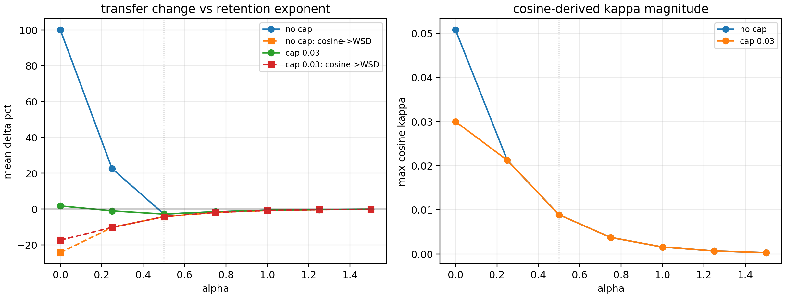

# Retention Power Audit

This audit sweeps the retention exponent in `kappa = R^alpha * MAP` while keeping the final degree-2 nuisance model and leave-curve-out EB tau fixed.

## Comparison

| alpha | cap | worst offdiag | mean offdiag | cosine -> WSD | wsdcon_9 -> WSD | max cosine kappa | cap saturation |
|---:|---:|---:|---:|---:|---:|---:|---:|
| 0.00 | none | +100.1% | -0.8% | -24.3% | -19.6% | 0.0508 | 0.0% |
| 0.25 | none | +22.6% | -9.6% | -10.2% | -17.7% | 0.0212 | 0.0% |
| 0.50 | none | -2.7% | -12.1% | -4.3% | -16.0% | 0.0089 | 0.0% |
| 0.75 | none | -1.4% | -11.3% | -1.8% | -14.4% | 0.0037 | 0.0% |
| 1.00 | none | -0.6% | -9.5% | -0.7% | -13.0% | 0.0016 | 0.0% |
| 1.25 | none | -0.3% | -8.0% | -0.3% | -11.8% | 0.0006 | 0.0% |
| 1.50 | none | -0.1% | -6.7% | -0.1% | -10.6% | 0.0003 | 0.0% |
| 0.00 | 0.03 | +1.8% | -12.2% | -17.4% | -18.1% | 0.0300 | 61.1% |
| 0.25 | 0.03 | -1.0% | -12.8% | -10.2% | -16.9% | 0.0212 | 38.9% |
| 0.50 | 0.03 | -2.7% | -12.4% | -4.3% | -15.9% | 0.0089 | 16.7% |
| 0.75 | 0.03 | -1.4% | -11.2% | -1.8% | -14.4% | 0.0037 | 11.1% |
| 1.00 | 0.03 | -0.6% | -9.5% | -0.7% | -13.0% | 0.0016 | 0.0% |
| 1.25 | 0.03 | -0.3% | -8.0% | -0.3% | -11.8% | 0.0006 | 0.0% |
| 1.50 | 0.03 | -0.1% | -6.7% | -0.1% | -10.6% | 0.0003 | 0.0% |

## Reading

The selected `alpha=0.50` estimator has worst off-diagonal -2.7% with cap and -2.7% without cap. This confirms that its stability is not primarily produced by the hard cap.

The best near-zero-worst setting in this sweep is `alpha=1.50`, cap `none`, with worst off-diagonal -0.1% and cosine -> WSD -0.1%. However, settings with very large alpha become overly conservative and erase useful cosine-to-WSD transfer. Settings near alpha=0.5 preserve useful transfer while controlling the amplitude failure seen at alpha=0.

The practical conclusion is that the square-root retention factor is not a numerically isolated trick. It sits in a stable middle regime between no identifiability correction and excessive shrinkage.
