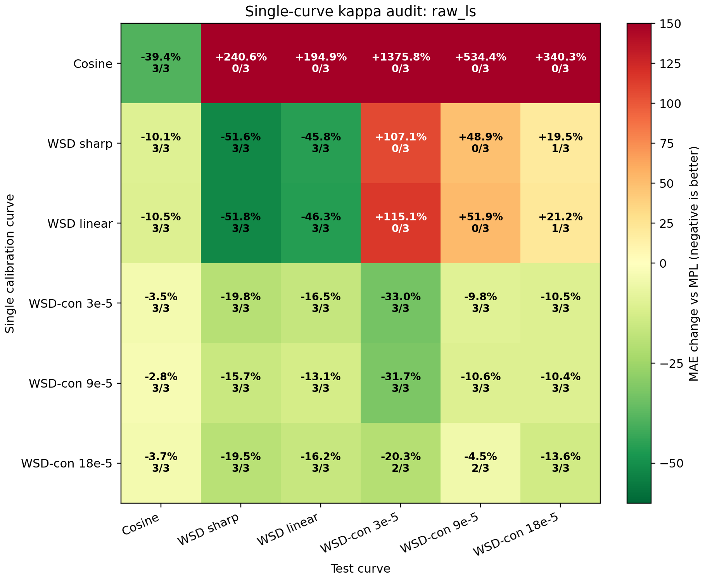
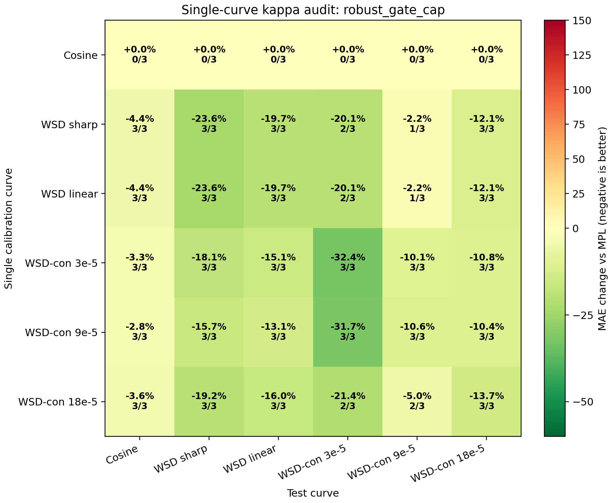
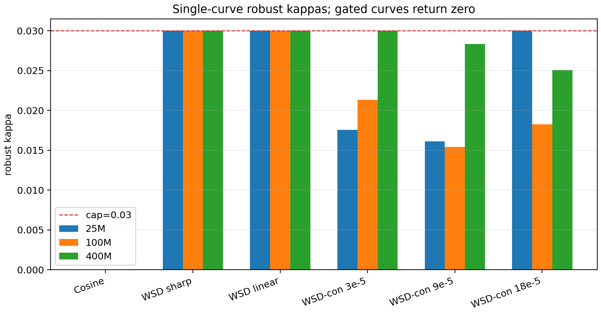

# Single-Curve Kappa Audit

This audit tests the stricter setting where exactly one curve is available for calibration. The recommended estimator is the theory-gated projected estimator:

```text
if total_positive_drop < 0.05 or feature_max < 0.05 or drop_effective_steps > 6000:
    kappa = 0
else:
    kappa = min(raw_nonnegative_ls_kappa, 0.03)
```

## Raw LS vs robust single-curve matrices

Raw LS:



Robust gate+cap:



## Learned single-curve kappas



## Summary

- Raw LS worst off-diagonal: `+1375.8%`.
- Robust worst off-diagonal: `+0.0%`.
- Robust median off-diagonal: `-10.6%`.
- Cosine is correctly declared non-identifiable and returns `kappa=0` at all scales.

## Key cells

| train curve | test curve | raw LS | robust | robust wins |
|---|---|---:|---:|---:|
| `cosine_72000` | `wsd_20000_24000` | +240.6% | +0.0% | 0/3 |
| `wsdcon_3` | `wsd_20000_24000` | -19.8% | -18.1% | 3/3 |
| `wsdcon_9` | `wsd_20000_24000` | -15.7% | -15.7% | 3/3 |
| `wsdcon_18` | `wsd_20000_24000` | -19.5% | -19.2% | 3/3 |
| `wsd_20000_24000` | `wsdcon_9` | +48.9% | -2.2% | 1/3 |
| `wsd_20000_24000` | `wsdld_20000_24000` | -45.8% | -19.7% | 3/3 |

## Interpretation

The robust estimator satisfies the single-curve safety requirement much better than raw LS. It does not force a correction from cosine, because cosine does not identify the non-adiabatic response. Single WSD-con probes still transfer to WSD sharp with a modest gain, and single WSD sharp/linear curves remain useful inside the WSD-like family. The price is intentional conservatism: capped WSD-family kappas give less diagonal improvement than raw LS, but avoid large cross-family over-correction.
