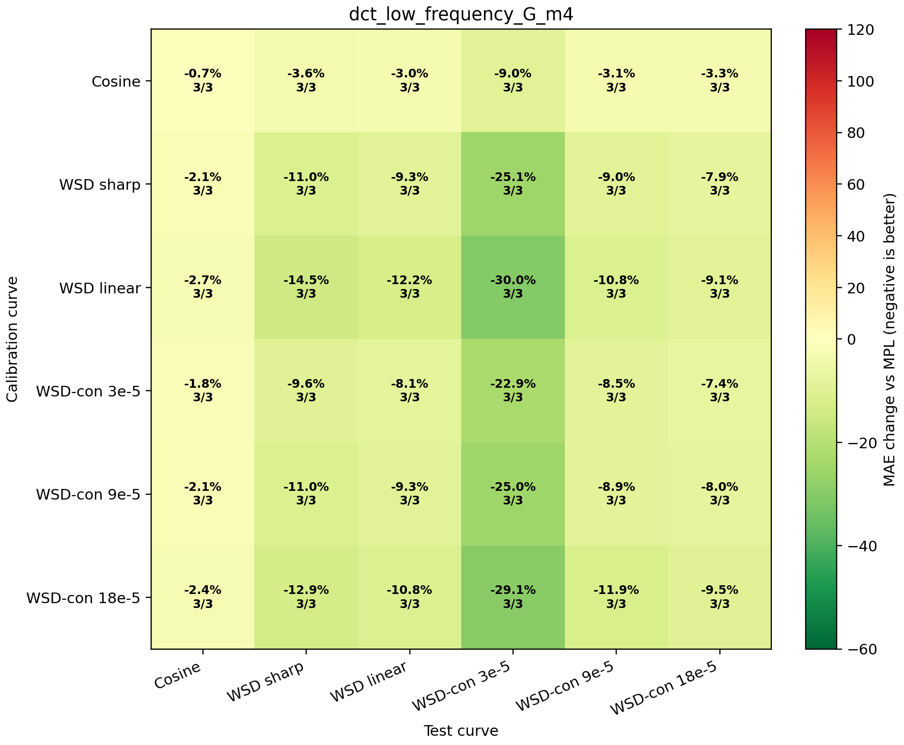
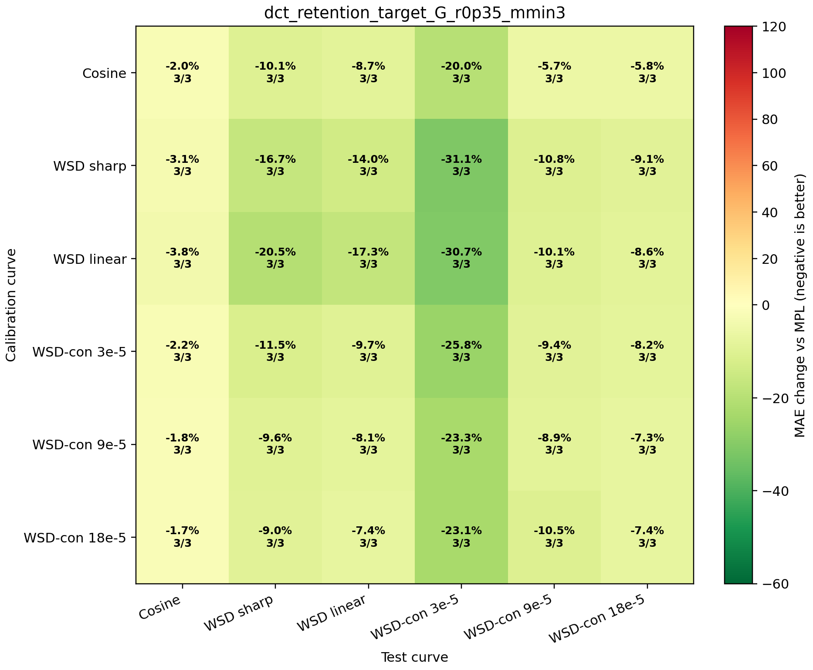

# Spectral Nuisance-Subspace Audit

This audit checks whether the final cap-free kappa estimator depends on the legacy smooth-basis implementation of `G`. The alternative `G` is the span of the constant vector and the first few discrete-cosine low-frequency modes. This is a more direct implementation of the paper-facing assumption that MPL residual drift is low frequency.

| G implementation | worst offdiag | median offdiag | mean offdiag | cosine -> WSD | wsdcon_9 -> WSD | max cosine kappa | mean retention |
|---|---:|---:|---:|---:|---:|---:|---:|
| legacy_smooth_G_m2 | -2.7% | -10.0% | -12.1% | -4.3% | -16.0% | 0.0089 | 0.379 |
| dct_low_frequency_G_m1 | +304.0% | -8.4% | +8.3% | -9.5% | -21.2% | 0.1926 | 0.560 |
| dct_low_frequency_G_m2 | +5.8% | -11.2% | -12.1% | -19.1% | -13.9% | 0.0375 | 0.379 |
| dct_low_frequency_G_m3 | -2.2% | -10.1% | -12.3% | -10.1% | -13.3% | 0.0314 | 0.312 |
| dct_low_frequency_G_m4 | -1.8% | -9.0% | -10.0% | -3.6% | -11.0% | 0.0070 | 0.234 |
| dct_low_frequency_G_m5 | -1.3% | -7.3% | -8.7% | -4.4% | -11.1% | 0.0161 | 0.211 |
| dct_low_frequency_G_m6 | -0.7% | -6.2% | -7.1% | -1.5% | -9.7% | 0.0032 | 0.180 |
| dct_low_frequency_G_m7 | -0.4% | -5.7% | -6.4% | -1.9% | -8.5% | 0.0070 | 0.164 |
| dct_low_frequency_G_m8 | -0.4% | -5.2% | -5.7% | -0.6% | -7.9% | 0.0013 | 0.149 |
| dct_low_frequency_G_m9 | -0.4% | -4.0% | -5.3% | -1.0% | -7.5% | 0.0033 | 0.131 |
| dct_low_frequency_G_m10 | -0.2% | -3.2% | -5.0% | -0.3% | -7.4% | 0.0008 | 0.125 |
| dct_low_frequency_G_m11 | -0.4% | -2.6% | -4.5% | -0.5% | -6.4% | 0.0017 | 0.111 |
| dct_low_frequency_G_m12 | -0.1% | -2.6% | -4.3% | -0.2% | -6.2% | 0.0005 | 0.107 |
| dct_retention_target_G_r0p2 | +304.0% | -8.1% | +7.6% | -9.5% | -6.6% | 0.1926 | 0.194 |
| dct_retention_target_G_r0p25 | +304.0% | -8.6% | +7.5% | -9.5% | -7.4% | 0.1926 | 0.225 |
| dct_retention_target_G_r0p25_mmin3 | -1.4% | -8.9% | -10.7% | -10.1% | -7.4% | 0.0314 | 0.192 |
| dct_retention_target_G_r0p2_mmin3 | -1.2% | -8.6% | -10.5% | -10.1% | -6.6% | 0.0314 | 0.176 |
| dct_retention_target_G_r0p3 | +304.0% | -7.3% | +8.5% | -9.5% | -8.9% | 0.1926 | 0.266 |
| dct_retention_target_G_r0p35 | +304.0% | -7.7% | +8.4% | -9.5% | -9.6% | 0.1926 | 0.274 |
| dct_retention_target_G_r0p35_mmin3 | -1.7% | -9.2% | -11.2% | -10.1% | -9.6% | 0.0314 | 0.212 |
| dct_retention_target_G_r0p3_mmin3 | -1.6% | -9.0% | -11.0% | -10.1% | -8.9% | 0.0314 | 0.203 |

## Readout

The balanced spectral reference is `dct_low_frequency_G_m4`: worst off-diagonal -1.8%, cosine -> WSD -3.6%, and mean off-diagonal -10.0%. The automatic constrained spectral rule `dct_retention_target_G_r0p35_mmin3` chooses the DCT bandwidth from the calibration feature by targeting identifiable energy while enforcing `K_min=3`; it gives worst off-diagonal -1.7%, cosine -> WSD -10.1%, and mean off-diagonal -11.2%. The current legacy implementation remains stronger on this matrix, with worst off-diagonal -2.7% and cosine -> WSD -4.3%. The one-mode spectral `G` is under-covered and fails badly (worst +304.0%), while the twelve-mode spectral `G` is over-covered and nearly erases the response (cosine -> WSD -0.2%). The unconstrained retention-target rule also fails (worst +304.0%), confirming that retention alone cannot choose `G`. Thus the useful spectral window is not a polynomial artifact, but the estimator does require a nuisance bandwidth that removes MPL drift without absorbing the schedule-response feature.
