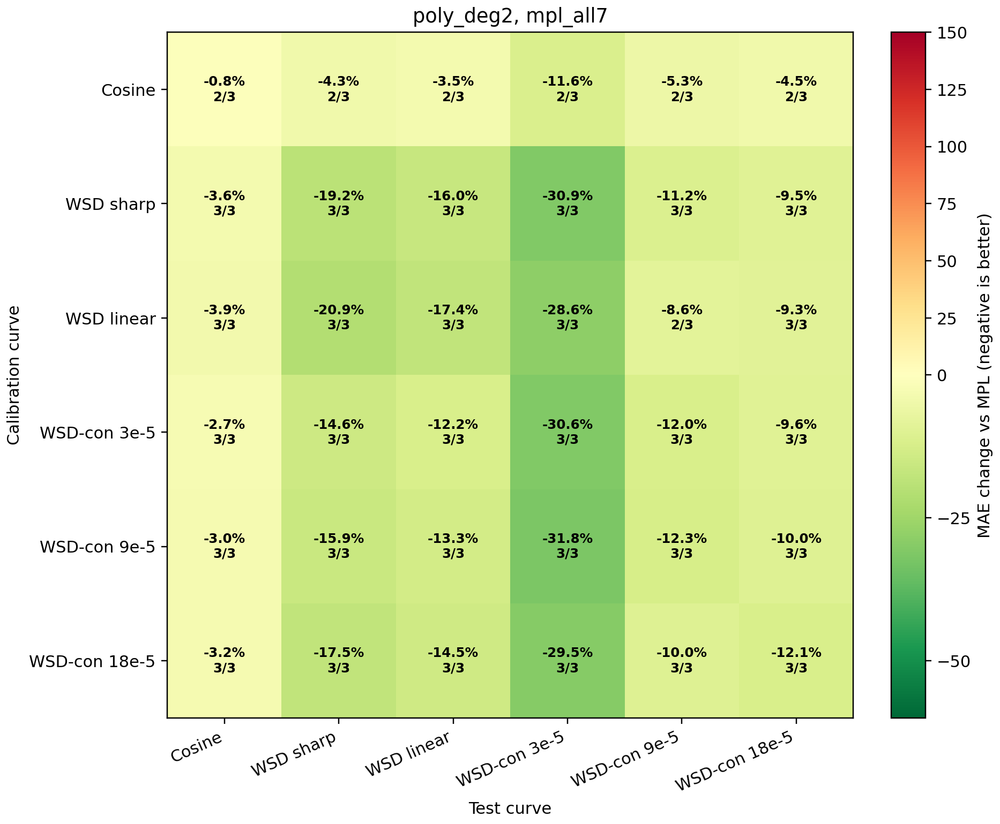

# MPL-Tangent Kappa Search

This experiment replaces polynomial nuisance trends with the local tangent space of the MPL predictor. It tests whether `kappa` should be estimated only from residual directions that cannot be explained by small MPL parameter perturbations.

## Formula

```text
r = loss - MPL(theta0)
J = d MPL(theta0) / d theta
phi_perp = M_J phi,    r_perp = M_J r
kappa_hat = min(0.03, max(0, <phi_perp,r_perp> / (||phi_perp||^2 + tau^2)))
```

This is the Frisch-Waugh-Lovell partial-regression estimator with an EB MAP prior. The nuisance directions now have a direct interpretation: they are exactly the loss-shape changes induced by local MPL parameter error.

## Comparison

| estimator | basis | worst offdiag | median offdiag | mean offdiag | cosine -> WSD | wsdcon_9 -> WSD |
|---|---|---:|---:|---:|---:|---:|
| `tangent_map` | `mpl_core3` | -1.0% | -12.9% | -12.6% | -24.0% | -16.9% |
| `tangent_map_retention` | `mpl_core3` | -1.0% | -12.9% | -12.5% | -24.0% | -16.6% |
| `poly_deg2` | `mpl_all7` | -2.7% | -10.6% | -12.4% | -4.3% | -15.9% |
| `poly_deg2` | `mpl_core3` | -2.7% | -10.6% | -12.4% | -4.3% | -15.9% |
| `poly_deg2` | `mpl_ld4` | -2.7% | -10.6% | -12.4% | -4.3% | -15.9% |
| `poly_deg2` | `mpl_no_L0` | -2.7% | -10.6% | -12.4% | -4.3% | -15.9% |
| `eb_q75` | `mpl_all7` | -1.0% | -10.9% | -10.8% | -3.1% | -15.4% |
| `eb_q75` | `mpl_core3` | -1.0% | -10.9% | -10.8% | -3.1% | -15.4% |
| `eb_q75` | `mpl_ld4` | -1.0% | -10.9% | -10.8% | -3.1% | -15.4% |
| `eb_q75` | `mpl_no_L0` | -1.0% | -10.9% | -10.8% | -3.1% | -15.4% |
| `current_smooth_cap` | `mpl_all7` | -0.0% | -10.9% | -10.1% | -0.0% | -15.4% |
| `current_smooth_cap` | `mpl_core3` | -0.0% | -10.9% | -10.1% | -0.0% | -15.4% |
| `current_smooth_cap` | `mpl_ld4` | -0.0% | -10.9% | -10.1% | -0.0% | -15.4% |
| `current_smooth_cap` | `mpl_no_L0` | -0.0% | -10.9% | -10.1% | -0.0% | -15.4% |
| `tangent_map` | `mpl_ld4` | -0.2% | -9.4% | -9.0% | -24.0% | -1.2% |
| `tangent_map` | `mpl_all7` | -0.2% | -9.3% | -9.0% | -24.0% | -1.1% |

## Recommendation

Best numeric candidate: `tangent_map_mpl_core3`. Recommended cap-safe candidate: `poly_deg2_mpl_all7`.



If a tangent-basis candidate beats the polynomial nuisance formula without cap saturation, it should become the main paper formula. If not, the polynomial degree-2 nuisance formula remains preferable because it gives stronger transfer with simpler robustness.
