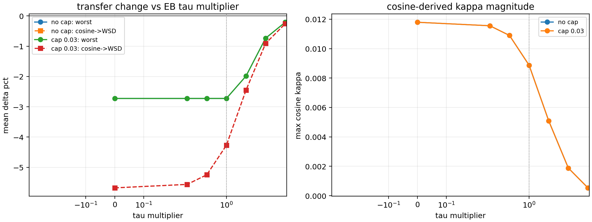

# Tau Sensitivity Audit

This audit multiplies the leave-curve-out EB `tau` by constants while keeping the final degree-2 nuisance projection and `sqrt(retention)` correction fixed.

## Comparison

| tau multiplier | cap | worst offdiag | mean offdiag | cosine -> WSD | wsdcon_9 -> WSD | max cosine kappa | cap saturation |
|---:|---:|---:|---:|---:|---:|---:|---:|
| 0.00 | none | -2.7% | -12.1% | -5.7% | -16.0% | 0.0118 | 0.0% |
| 0.25 | none | -2.7% | -12.1% | -5.6% | -16.0% | 0.0116 | 0.0% |
| 0.50 | none | -2.7% | -12.1% | -5.2% | -16.0% | 0.0109 | 0.0% |
| 1.00 | none | -2.7% | -12.1% | -4.3% | -16.0% | 0.0089 | 0.0% |
| 2.00 | none | -2.0% | -12.1% | -2.5% | -16.0% | 0.0051 | 0.0% |
| 4.00 | none | -0.7% | -11.5% | -0.9% | -15.9% | 0.0019 | 0.0% |
| 8.00 | none | -0.2% | -9.2% | -0.3% | -15.7% | 0.0005 | 0.0% |
| 0.00 | 0.03 | -2.7% | -12.6% | -5.7% | -15.9% | 0.0118 | 22.2% |
| 0.25 | 0.03 | -2.7% | -12.6% | -5.6% | -15.9% | 0.0116 | 22.2% |
| 0.50 | 0.03 | -2.7% | -12.5% | -5.2% | -15.9% | 0.0109 | 22.2% |
| 1.00 | 0.03 | -2.7% | -12.4% | -4.3% | -15.9% | 0.0089 | 16.7% |
| 2.00 | 0.03 | -2.0% | -12.1% | -2.5% | -15.9% | 0.0051 | 16.7% |
| 4.00 | 0.03 | -0.7% | -11.4% | -0.9% | -15.9% | 0.0019 | 16.7% |
| 8.00 | 0.03 | -0.2% | -9.2% | -0.3% | -15.7% | 0.0005 | 0.0% |

## Reading

The selected EB scale (`1.00x`) gives worst off-diagonal -2.7% and cosine -> WSD -4.3% with cap.

Changing tau by a factor of two remains stable: `0.50x` gives worst -2.7% and `2.00x` gives worst -2.0% with cap. The main tradeoff is expected: smaller tau gives stronger transfer but more amplitude risk, while larger tau is more conservative.

The practical conclusion is that the final method does not rely on an exact tau value. EB tau places the estimator in the useful middle regime, and the retention factor handles most of the amplitude stabilization.
