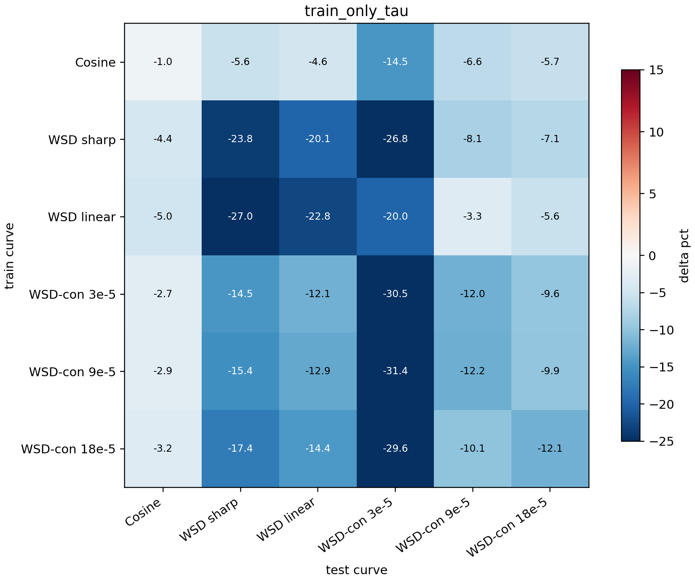

# Train-Only Tau Audit

This audit checks whether the final single-curve transfer matrix depends on estimating EB `tau` from curves that may include the held-out test curve. It compares the previous leave-calibration-curve-out tau with a stricter train-only tau estimated from the calibration curve itself.

## Comparison

| tau mode | worst offdiag | mean offdiag | cosine -> WSD | wsdcon_9 -> WSD | max cosine kappa | mean tau |
|---|---:|---:|---:|---:|---:|---:|
| `other_curves_tau` | -2.7% | -12.1% | -4.3% | -16.0% | 0.0089 | 0.0430 |
| `train_only_tau` | -2.7% | -12.1% | -5.6% | -15.4% | 0.0117 | 0.0837 |

## Reading

The stricter train-only tau gives worst off-diagonal -2.7% and cosine -> WSD -5.6%, compared with -2.7% and -4.3% under the previous other-curves tau. Thus the main transfer conclusion does not rely on using held-out test curves to set the EB regularization scale.
