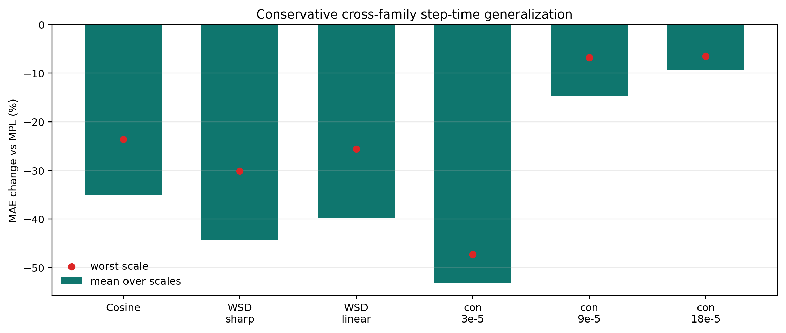

# Conservative Cross-Family Step-Time Estimator

This audit responds to the main overfitting concern in the shape-routed head.  It keeps the image-derived transient model, but forbids a target from borrowing calibration from the same schedule family.

## Formula

```text
r(t) = kappa * phi_tau(t) + nuisance + eps
phi_tau(t) = sum_{u<=t} exp(-(t-u)/tau) * relu(eta_{u-1}-eta_u) / eta_peak
kappa_target = alpha(target, source) * kappa_source
alpha = min(1, (target_total_drop / source_mean_total_drop)^2)
```

The drop-squared attenuation is used only when a weaker single-step target borrows from stronger finite-tail WSD sources.  It is schedule-only and uses no target loss residual.

## Main Result

- Cross-family target-holdout: mean `-32.7%`, worst `-6.5%`, non-harm `18/18`.
- Extended safety audit: mean `-21.8%`, worst `+0.0%`, non-harm `27/27`.
- Same-family source routes: `0/6` for the conservative head versus `4/6` for the stronger shape-routed head.



## Route Table

| target | target family | route | source | source family | tau | nuisance | attenuation |
|---|---|---|---|---|---:|---|---:|
| Cosine | smooth_decay | smooth_from_full_step | `wsdcon_3` | single_step | 8192 | `dct4` | 1.000 |
| WSD sharp | finite_tail | finite_tail_from_steps | `wsdcon_18+wsdcon_3+wsdcon_9` | single_step | 3072 | `dct4` | 1.000 |
| WSD linear | finite_tail | finite_tail_from_steps | `wsdcon_18+wsdcon_3+wsdcon_9` | single_step | 3072 | `dct4` | 1.000 |
| WSD-con 3e-5 | single_step | full_step_from_finite_tail | `wsd_20000_24000+wsdld_20000_24000` | finite_tail | 1536 | `dct2` | 1.000 |
| WSD-con 9e-5 | single_step | medium_step_from_finite_tail | `wsd_20000_24000+wsdld_20000_24000` | finite_tail | 768 | `dct2` | 0.605 |
| WSD-con 18e-5 | single_step | weak_step_from_finite_tail | `wsd_20000_24000+wsdld_20000_24000` | finite_tail | 512 | `none` | 0.198 |

## Per-Target Summary

| target | mean | worst | non-harm |
|---|---:|---:|---:|
| Cosine | -35.0% | -23.7% | 3/3 |
| WSD sharp | -44.3% | -30.1% | 3/3 |
| WSD linear | -39.7% | -25.6% | 3/3 |
| WSD-con 3e-5 | -53.1% | -47.3% | 3/3 |
| WSD-con 9e-5 | -14.6% | -6.7% | 3/3 |
| WSD-con 18e-5 | -9.4% | -6.5% | 3/3 |

## Attenuation Ablation

| audit | mean | worst | non-harm | reading |
|---|---:|---:|---:|---|
| final_cross_family_squared | -32.7% | -6.5% | 18/18 | drop-squared attenuation for single-step targets |
| linear_drop_attenuation | -30.5% | +10.1% | 15/18 | linear target/source drop attenuation |
| no_drop_attenuation | -21.8% | +75.3% | 14/18 | no attenuation for weaker single-step targets |
| zero_medium_weak_step | -28.7% | +0.0% | 18/18 | no cross-family correction for medium/weak single-step targets |

## Comparison To Stronger Shape-Routed Head

| estimator | mean | worst | non-harm | same-family source routes |
|---|---:|---:|---:|---:|
| shape-routed | -36.1% | -7.0% | 18/18 | 4/6 |
| conservative cross-family | -32.7% | -6.5% | 18/18 | 0/6 |

## Reading

- This is the cleaner generalization story: it sacrifices a few MAE points relative to the stronger routed head, but removes same-family source calibration from the core target-holdout audit.
- The no-attenuation ablation is harmful, so the weaker-step correction needs a schedule-only amplitude attenuation rather than a full transfer of WSD-calibrated kappa.
- This still does not replace external validation.  It is a stronger internal audit that reduces, but does not eliminate, benchmark-overfitting concern.
