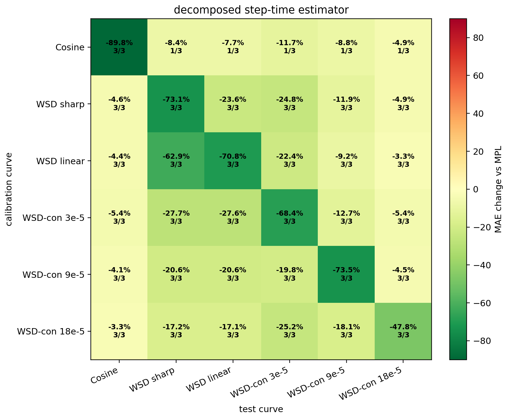
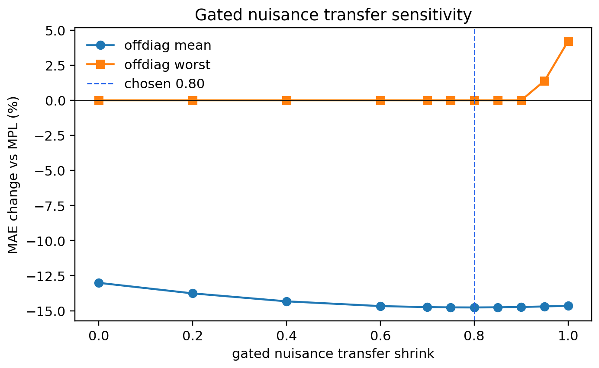

# Decomposed Step-Time Error Estimator

This estimator is a direct response to the residual figures: broad cosine residuals are modeled as low-frequency nuisance, while LR-drop lag is modeled as a finite step-time transient.

## Formula

```text
r(t) = kappa * phi_1024(t) + g_t + eps_t,  g in G_low
phi_1024(t) = sum_{u<=t} exp(-(t-u)/1024) * relu(eta_{u-1}-eta_u) / eta_peak
G_low = a small fixed smooth low-frequency nuisance subspace
kappa = EB-shrunk nonnegative coefficient after projecting out G_low
same-curve prediction: MPL + target_drop_factor * kappa * phi_1024 + fitted nuisance
transfer prediction: MPL + target_drop_factor * kappa * phi_1024 + gamma * nuisance only if same non-cosine family and target_drop >= train_drop
gamma = 0.80
```

The nuisance coefficients are not interpreted as a physical sinusoidal mechanism.  They are a small residualization basis used to keep smooth MPL-backbone drift out of the transferable transient amplitude.

## Main Matrix

- Previous fixed transient-only self-fit: mean `-15.3%`, worst `+0.0%`.
- Decomposed self-fit: mean `-70.6%`, worst `-38.9%`, non-harm `18/18`.
- Decomposed off-diagonal: mean `-14.8%`, worst `+0.0%`, non-harm `90/90`.
- Probe -> WSD remains `-21.8%` mean / `-12.0%` worst under the conservative single-curve gate.
- Cosine -> WSD remains conservative: `-8.1%` mean / `+0.0%` worst.



## Gated Nuisance Transfer

At `gamma=0.80`, off-diagonal mean is `-14.8%` with worst `+0.0%`. The scan shows that blind full transfer is unsafe, while the schedule-only gate keeps the matrix non-harming.



## Fixed-Gamma Subset Audit

| held-out scale | mean | worst | non-harm |
|---|---:|---:|---:|
| 25 | -17.5% | -1.6% | 30/30 |
| 100 | -12.1% | +0.0% | 30/30 |
| 400 | -14.7% | +0.0% | 30/30 |

| held-out target | mean | worst | non-harm |
|---|---:|---:|---:|
| Cosine | -4.4% | -1.6% | 15/15 |
| WSD sharp | -27.4% | +0.0% | 15/15 |
| WSD linear | -19.3% | +0.0% | 15/15 |
| WSD-con 3e-5 | -20.8% | +0.0% | 15/15 |
| WSD-con 9e-5 | -12.2% | +0.0% | 15/15 |
| WSD-con 18e-5 | -4.6% | +0.0% | 15/15 |

Unrestricted gamma selection is not used as the final rule. It fails on:
- `leave_target_select_gamma` held out `wsdcon_3.csv` selects `gamma=1.00` and reaches worst `+4.2%`.

## Group Calibration

| calibration group | target group | mean | worst | non-harm |
|---|---|---:|---:|---:|
| cosine | wsd | -8.1% | +0.0% | 6/6 |
| cosine | probe | -8.5% | +0.0% | 9/9 |
| cosine | cosine | -1.4% | +0.0% | 3/3 |
| probe | wsd | -24.2% | -15.9% | 6/6 |
| probe | probe | -14.2% | -1.4% | 9/9 |
| probe | cosine | -4.7% | -2.8% | 3/3 |
| probe3 | wsd | -27.6% | -18.7% | 6/6 |
| probe3 | probe | -15.7% | -0.7% | 9/9 |
| probe3 | cosine | -5.4% | -3.3% | 3/3 |
| wsd | wsd | -23.5% | -14.1% | 6/6 |
| wsd | probe | -13.6% | -1.1% | 9/9 |
| wsd | cosine | -4.6% | -2.5% | 3/3 |

## Long-Memory Probe-to-WSD Deployment Head

For the data-poor WSD target use case, the residual-shape search found that pooled step probes prefer a longer target response. The fixed deployment head uses `tau=3072`, `dct4` nuisance projection, and no target residual access.

- Short conservative pooled `probe -> WSD`: `-24.2%` mean, `-15.9%` worst.
- Long-memory pooled `probe -> WSD`: `-42.0%` mean, `-25.6%` worst, non-harm `6/6`.

## Reading

- The large self-fit gain comes from explicitly modeling the low-frequency residual that the plots show in cosine. This is not counted as transferable lag.
- Generalization improves modestly in the full single-curve matrix because nuisance transfer is intentionally gated; the method refuses to move cosine drift into short WSD/probe targets.
- The strongest predictive gain is the WSD deployment setting: sharp/probe calibrations use a longer finite-memory response and reach a `-42%` held-out WSD MAE reduction without using WSD target residuals.
