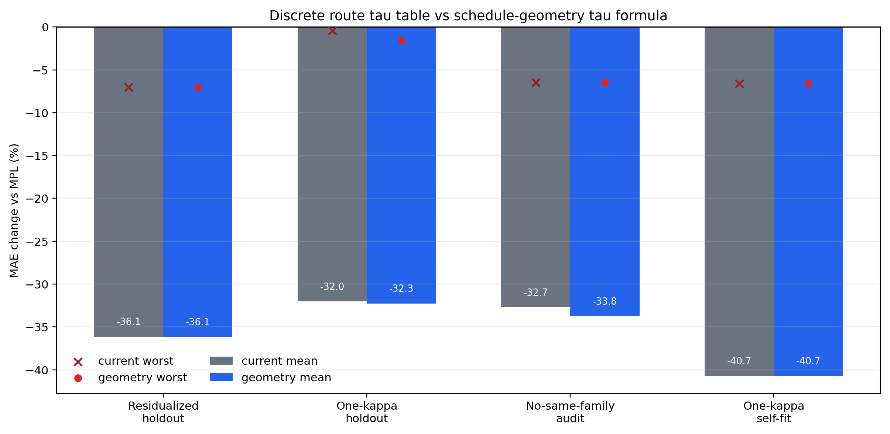

# Schedule-Geometry Tau Audit

This audit replaces the discrete response-time table with a tau computed directly from LR positive-drop geometry.  It is meant to reduce benchmark-shaped route complexity while preserving the residual-image correction.

## Formula

For no-drop and short-smooth safety controls, `tau=0` and the correction abstains.  Otherwise:

```text
if positive_drop_span > 100:
    tau = min(8192, 1.25 * positive_drop_span)
else:
    q = clip((total_positive_drop - 0.40) / (0.90 - 0.40), 0, 1)
    tau = 512 * (1 + 2 q^3)
```

This keeps the physical reading from the residual plots: long decays need longer memory, while weak single-step drops should have shorter memory and smaller transferable lag.

## Main Result

- Residualized target-holdout: current `-36.1%` mean / `-7.0%` worst; geometry tau `-36.1%` mean / `-7.0%` worst.
- One-kappa/no-nuisance target-holdout: current `-32.0%` / `-0.4%`; geometry tau `-32.3%` / `-1.5%`.
- No-same-family residualized audit: current `-32.7%` / `-6.5%`; geometry tau `-33.8%` / `-6.5%`.
- Extended safety remains non-harming: `27/27` rows, worst `+0.0%`.



## Comparison Table

| model | role | mean | worst | non-harm | wins | reading |
|---|---|---:|---:|---:|---:|---|
| current_shape_routed | baseline residualized target-holdout | -36.1% | -7.0% | 18/18 | 18/18 | discrete route tau table |
| current_minimal_no_nuisance | baseline one-kappa target-holdout | -32.0% | -0.4% | 18/18 | 18/18 | discrete route tau table |
| current_cross_family | baseline no-same-family audit | -32.7% | -6.5% | 18/18 | 18/18 | discrete route tau table |
| current_self_fit_no_nuisance | baseline self-fit | -40.7% | -6.6% | 18/18 | 18/18 | discrete route tau table |
| geometry_shape_routed | geometry-tau residualized target-holdout | -36.1% | -7.0% | 18/18 | 18/18 | same route/source/nuisance as current; tau from LR geometry |
| geometry_no_nuisance | geometry-tau one-kappa target-holdout | -32.3% | -1.5% | 18/18 | 18/18 | no nuisance projection; tau from LR geometry |
| geometry_cross_family | geometry-tau no-same-family audit | -33.8% | -6.5% | 18/18 | 18/18 | cross-family source rule; tau from target LR geometry |
| geometry_self_fit_no_nuisance | geometry-tau one-kappa self-fit | -40.7% | -6.6% | 18/18 | 18/18 | same target residual fits kappa only; tau from LR geometry |

## Route Tau Table

| target | route | drop | span | table tau | geometry tau | nuisance | source |
|---|---|---:|---:|---:|---:|---|---|
| Cosine | smooth_decay | 0.900 | 69839 | 8192.0 | 8192.0 | `dct4` | `wsdcon_3` |
| WSD sharp | finite_tail | 0.900 | 3999 | 5120.0 | 4998.8 | `none` | `wsdld_20000_24000` |
| WSD linear | finite_tail | 0.900 | 3999 | 5120.0 | 4998.8 | `none` | `wsd_20000_24000` |
| WSD-con 3e-5 | full_step_drop | 0.900 | 1 | 1536.0 | 1536.0 | `dct2` | `wsd_20000_24000+wsdld_20000_24000` |
| WSD-con 9e-5 | medium_step_drop | 0.700 | 1 | 768.0 | 733.2 | `dct2` | `wsdcon_3+wsdcon_18` |
| WSD-con 18e-5 | weak_step_drop | 0.400 | 1 | 512.0 | 512.0 | `none` | `wsdcon_9` |

## Scale Slices

| model | scale | mean | worst | non-harm |
|---|---:|---:|---:|---:|
| geometry_shape_routed | 25 | -32.4% | -16.3% | 6/6 |
| geometry_shape_routed | 100 | -36.3% | -9.4% | 6/6 |
| geometry_shape_routed | 400 | -39.7% | -7.0% | 6/6 |
| geometry_no_nuisance | 25 | -30.3% | -14.4% | 6/6 |
| geometry_no_nuisance | 100 | -30.2% | -1.5% | 6/6 |
| geometry_no_nuisance | 400 | -36.3% | -7.0% | 6/6 |
| geometry_cross_family | 25 | -29.5% | -9.5% | 6/6 |
| geometry_cross_family | 100 | -33.3% | -7.3% | 6/6 |
| geometry_cross_family | 400 | -38.5% | -6.5% | 6/6 |
| geometry_self_fit_no_nuisance | 25 | -40.5% | -20.8% | 6/6 |
| geometry_self_fit_no_nuisance | 100 | -42.6% | -8.9% | 6/6 |
| geometry_self_fit_no_nuisance | 400 | -38.9% | -6.6% | 6/6 |

## Formula Stability

This is a sensitivity audit, not model selection.  It checks whether small formula perturbations immediately break the correction.

| model | variant | mean | worst | non-harm | reading |
|---|---|---:|---:|---:|---|
| residualized | baseline | -36.1% | -7.0% | 18/18 | baseline formula |
| residualized | tail_x0.9 | -36.1% | -7.0% | 18/18 | tail response coefficient -10% |
| residualized | tail_x1.1 | -36.1% | -7.0% | 18/18 | tail response coefficient +10% |
| residualized | step_base_x0.75 | -34.6% | -7.7% | 18/18 | single-step base tau -25% |
| residualized | step_base_x1.25 | -35.3% | -3.2% | 18/18 | single-step base tau +25% |
| residualized | step_power_2 | -35.9% | -6.2% | 18/18 | less conservative single-step drop exponent |
| residualized | step_power_4 | -36.0% | -7.0% | 18/18 | more conservative single-step drop exponent |
| no_nuisance | baseline | -32.3% | -1.5% | 18/18 | baseline formula |
| no_nuisance | tail_x0.9 | -32.3% | -1.5% | 18/18 | tail response coefficient -10% |
| no_nuisance | tail_x1.1 | -32.2% | -1.5% | 18/18 | tail response coefficient +10% |
| no_nuisance | step_base_x0.75 | -31.9% | -7.7% | 18/18 | single-step base tau -25% |
| no_nuisance | step_base_x1.25 | -30.5% | +4.0% | 17/18 | single-step base tau +25% |
| no_nuisance | step_power_2 | -31.3% | +3.0% | 17/18 | less conservative single-step drop exponent |
| no_nuisance | step_power_4 | -32.7% | -4.6% | 18/18 | more conservative single-step drop exponent |
| cross_family | baseline | -33.8% | -6.5% | 18/18 | baseline formula |
| cross_family | tail_x0.9 | -33.7% | -6.5% | 18/18 | tail response coefficient -10% |
| cross_family | tail_x1.1 | -33.8% | -6.5% | 18/18 | tail response coefficient +10% |
| cross_family | step_base_x0.75 | -32.8% | -6.3% | 18/18 | single-step base tau -25% |
| cross_family | step_base_x1.25 | -33.0% | -4.3% | 18/18 | single-step base tau +25% |
| cross_family | step_power_2 | -33.5% | -4.9% | 18/18 | less conservative single-step drop exponent |
| cross_family | step_power_4 | -33.9% | -6.5% | 18/18 | more conservative single-step drop exponent |

## Decision

- Geometry tau is a better default than the raw discrete tau table for future frozen-rule validation: it reduces route-specific constants and slightly improves the no-nuisance and cross-family audits.
- The sensitivity audit shows that the residualized and cross-family variants are non-harming under all tested perturbations.  The no-nuisance head is more sensitive to the single-step exponent/base, which supports keeping the conservative cubic single-step rule.
- It does not create a new headline performance jump; its value is interpretability and overfit control.  The stronger self-fit story still comes from the decomposed residual diagnostic, not from changing tau.
- The next real performance evidence still needs new curves or new training runs.  More retrospective tau tuning on the same six core schedules is not justified by the Pareto audit.
