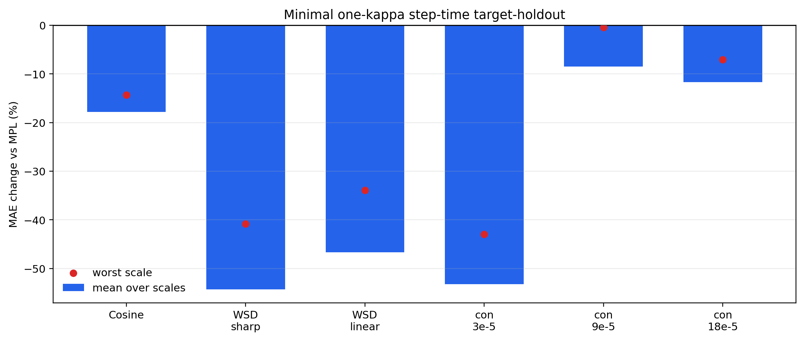

# Minimal One-Kappa Step-Time Estimator

This is the current recommended clean model candidate.  It keeps only the transferable transient response and removes all fitted low-frequency nuisance coefficients from the prediction rule.

## Formula

```text
r(t) = L_true(t) - L_MPL(t)
phi_tau(t) = sum_{u<=t} exp(-(t-u)/tau) * relu(eta_{u-1}-eta_u) / eta_peak
kappa_hat = max(0, <phi_tau, r_source> / ||phi_tau||^2)
L_hat_target(t) = L_MPL,target(t) + kappa_hat * phi_tau,target(t)
```

Only `kappa` is fitted from calibration loss residuals.  The route, tau, source set, and safety gates are schedule-only choices and are audited as model-selection freedom.

## Main Result

- Minimal target-holdout: mean `-32.0%`, worst `-0.4%`, non-harm `18/18`.
- Extended controls: mean `-21.4%`, worst `+0.0%`, non-harm `27/27`.
- Strict no-same-family/no-nuisance audit: mean `-24.6%`, worst `-3.5%`, non-harm `18/18`.



## Route Table

| target | drop | span | route | source | tau |
|---|---:|---:|---|---|---:|
| Cosine | 0.900 | 69839 | smooth_decay | `wsdcon_3` | 8192 |
| WSD sharp | 0.900 | 3999 | finite_tail | `wsdld_20000_24000` | 5120 |
| WSD linear | 0.900 | 3999 | finite_tail | `wsd_20000_24000` | 5120 |
| WSD-con 3e-5 | 0.900 | 1 | full_step_drop | `wsd_20000_24000+wsdld_20000_24000` | 1536 |
| WSD-con 9e-5 | 0.700 | 1 | medium_step_drop | `wsdcon_3+wsdcon_18` | 768 |
| WSD-con 18e-5 | 0.400 | 1 | weak_step_drop | `wsdcon_9` | 512 |

## Per-Target Summary

| target | mean | worst | non-harm |
|---|---:|---:|---:|
| Cosine | -17.8% | -14.4% | 3/3 |
| WSD sharp | -54.3% | -40.9% | 3/3 |
| WSD linear | -46.7% | -33.9% | 3/3 |
| WSD-con 3e-5 | -53.2% | -42.9% | 3/3 |
| WSD-con 9e-5 | -8.5% | -0.4% | 3/3 |
| WSD-con 18e-5 | -11.7% | -7.0% | 3/3 |

## Necessity Tests

| audit | mean | worst | non-harm | reading |
|---|---:|---:|---:|---|
| minimal_core | -32.0% | -0.4% | 18/18 | minimal one-kappa routed rule on core targets |
| minimal_extended | -21.4% | +0.0% | 27/27 | minimal rule plus short-cosine and constant controls |
| fixed_tau_1024 | -23.1% | +6.8% | 16/18 | one universal response time |
| no_short_smooth_gate | -16.5% | +67.1% | 24/27 | allows short smooth cosine to receive transient correction |
| strict_cross_family_p3 | -24.6% | -3.5% | 18/18 | no same-family source, no nuisance, drop-cubed weak-step attenuation |
| cross_family_no_attenuation | -12.1% | +75.3% | 13/18 | no same-family source and no weak-step attenuation |
| tau_x0.5 | -27.1% | -3.6% | 18/18 | minimal route with all nonzero taus multiplied by 0.5 |
| tau_x0.75 | -31.6% | -7.1% | 18/18 | minimal route with all nonzero taus multiplied by 0.75 |
| tau_x1.25 | -30.3% | +5.2% | 17/18 | minimal route with all nonzero taus multiplied by 1.25 |
| tau_x1.5 | -28.0% | +9.8% | 14/18 | minimal route with all nonzero taus multiplied by 1.5 |
| tau_x2 | -24.0% | +16.7% | 14/18 | minimal route with all nonzero taus multiplied by 2 |

## Reading

- The core improvement does not require a fitted sinusoidal or DCT nuisance component.
- A universal tau is insufficient: `fixed_tau_1024` reaches worst `+6.8%`.
- The short-smooth safety gate is necessary: removing it reaches worst `+67.1%`.
- Cross-family weak-step attenuation is necessary: removing it reaches worst `+75.3%`.
- This is the preferred headline model if interpretability and overfit control are prioritized over the largest same-curve self-fit number.
