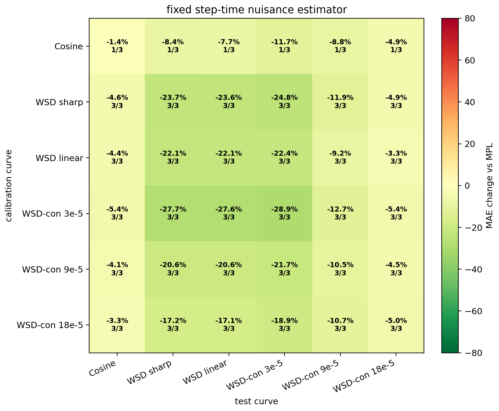

# Fixed Step-Time Nuisance Estimator

This is the fixed implementation of the image-driven candidate selected in `../step_time_nuisance_estimator/REPORT.md` and stress-checked in `../step_time_nuisance_holdout_audit/REPORT.md`.

## Formula

```text
phi_tau(t) = sum_{u<=t} exp(-(t-u)/1024) * relu(eta_{u-1}-eta_u) / eta_peak
G = span{1, sin(pi z), cos(pi z), sin(2 pi z), cos(2 pi z)}
phi_perp = M_G phi_tau,   r_perp = M_G(observed_loss - MPL)
tau_EB = median(projected_residual_scale) / q75(projected_raw_kappa)
kappa = max(0, <phi_perp, r_perp> / (||phi_perp||^2 + tau_EB^2))
target_factor = min(total_positive_lr_drop(target)/0.9, 1)
prediction = MPL + target_factor * kappa * phi_tau(target)
```

## Single-Curve Matrix

- Self-fit mean `-15.3%`, worst `+0.0%`, non-harm `18/18`.
- Off-diagonal mean `-13.0%`, worst `+0.0%`, non-harm `90/90`.
- Probe -> WSD mean `-21.8%`, worst `-12.0%`.
- Cosine -> WSD mean `-8.1%`, worst `+0.0%`.



## Group Calibration

| calibration group | target group | mean | worst | non-harm |
|---|---|---:|---:|---:|
| cosine | wsd | -8.1% | +0.0% | 6/6 |
| cosine | probe | -8.5% | +0.0% | 9/9 |
| cosine | cosine | -1.4% | +0.0% | 3/3 |
| probe | wsd | -24.2% | -15.9% | 6/6 |
| probe | probe | -14.2% | -1.4% | 9/9 |
| probe | cosine | -4.7% | -2.8% | 3/3 |
| probe3 | wsd | -27.6% | -18.7% | 6/6 |
| probe3 | probe | -15.7% | -0.7% | 9/9 |
| probe3 | cosine | -5.4% | -3.3% | 3/3 |
| wsd | wsd | -23.5% | -14.1% | 6/6 |
| wsd | probe | -13.6% | -1.1% | 9/9 |
| wsd | cosine | -4.6% | -2.5% | 3/3 |

## Reading

- Single-curve calibration is non-harming on all `108` tested rows and improves the off-diagonal mean by `-13.0%`.
- Pooled probe calibration remains stronger for WSD targets: `probe -> WSD` mean `-24.2%`, worst `-15.9%`; endpoint probe `wsdcon_3 -> WSD` mean `-27.6%`, worst `-18.7%`.
- The method intentionally suppresses diffuse cosine-derived amplitudes when the residualized response direction is not identifiable, while retaining sharp/probe amplitudes.
- Interpretation for the cosine lag diagnostic: the cosine residual behaves like a broad low-frequency wave, not like a persistent physical catch-up delay. The fixed estimator therefore uses cosine mainly to estimate the nuisance subspace and reads transferable amplitude from sharp or probe-like LR drops.
