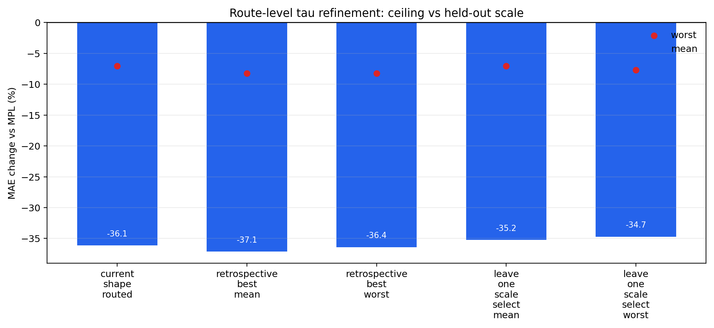

# Step-Time Pareto Audit

This audit organizes the current residual-model evidence by the two axes that matter here: self-fit and generalization.  It also checks whether route-level tau tuning has meaningful unused headroom.

## Main Takeaway

- Best same-curve explanation is still `decomposed_self_fit`: self-fit mean `-70.6%`, worst `-38.9%`.  This explains the residual figures but is not the transferable headline rule.
- Clean one-kappa deployment gives generalization mean `-32.0%`, worst `-0.4%`.
- Geometry-tau one-kappa deployment gives mean `-32.3%`, worst `-1.5%` while replacing route-specific tau constants with an LR-geometry formula.
- Strong residualized deployment gives generalization mean `-36.1%`, worst `-7.0%`.
- Geometry-tau no-same-family residualized audit gives mean `-33.8%`, worst `-6.5%`; this is the best current evidence against pure same-family transfer.
- Retrospective route-tau tuning only raises the internal target-holdout mean from `-36.1%` to `-37.1%`.  Leave-one-scale selection falls back to `-35.2%`, so this tuning is not strong enough to replace the current fixed route taus.

## Model Table

| model | role | self mean | self worst | generalization mean | generalization worst | non-harm | target residual? | parameters | reading |
|---|---|---:|---:|---:|---:|---:|---|---|---|
| minimal_one_kappa | deployment_candidate | -40.7% | -6.6% | -32.0% | -0.4% | 18/18 | no | 1 kappa | cleanest transferable model; strongest interpretability/overfit-control tradeoff |
| geometry_tau_one_kappa | deployment_candidate | -40.7% | -6.6% | -32.3% | -1.5% | 18/18 | no | 1 kappa; tau from LR geometry | same one-kappa rule with fewer route-specific tau constants and slightly stronger strict worst-case behavior |
| shape_routed_residualized | strong_deployment_candidate |  |  | -36.1% | -7.0% | 18/18 | no | 1 kappa plus projection during calibration | best current internal target-holdout result; projection reduces smooth-drift contamination |
| geometry_tau_residualized | strong_deployment_candidate |  |  | -36.1% | -7.0% | 18/18 | no | 1 kappa plus projection; tau from LR geometry | matches the table-tau residualized result while replacing route tau constants with a geometry formula |
| cross_family_residualized | generalization_audit |  |  | -32.7% | -6.5% | 18/18 | no | 1 kappa plus projection during calibration | removes same-family calibration; keeps most of the deployment gain |
| geometry_tau_cross_family | generalization_audit |  |  | -33.8% | -6.5% | 18/18 | no | 1 kappa plus projection; tau from LR geometry | best current no-same-family audit and uses target LR geometry for response time |
| strict_cross_family_minimal | strict_audit |  |  | -24.6% | -3.5% | 18/18 | no | 1 kappa | strictest current no-nuisance/no-same-family check; useful but conservative |
| decomposed_self_fit | diagnostic_self_fit | -70.6% | -38.9% | -14.8% | +0.0% | 90/90 offdiag | yes for same-curve diagnostic | kappa plus low-frequency coefficients | best explanation of residual plots; not the headline transferable mechanism |
| old_samefit_s_time | diagnostic_samefit_reference | -32.3% | -5.6% |  |  | 18/18 | yes | 1 target amplitude per panel | same-target shape diagnostic only; useful foil for minimal holdout |

## Route-Tau Refinement Check

The tau-refinement search is deliberately marked as retrospective.  It only changes route-level multipliers and does not add a new residual basis or extra fitted loss parameter.

| audit | mean | worst | non-harm | protocol |
|---|---:|---:|---:|---|
| current_shape_routed | -36.1% | -7.0% | 18/18 | fixed current route taus |
| retrospective_best_mean | -37.1% | -8.2% | 18/18 | selected on all core targets/scales |
| retrospective_best_worst | -36.4% | -8.2% | 18/18 | selected on all core targets/scales |
| leave_one_scale_select_mean | -35.2% | -7.0% | 18/18 | select route multipliers on two scales by mean, evaluate the held-out scale |
| leave_one_scale_select_worst | -34.7% | -7.7% | 18/18 | select route multipliers on two scales by worst, evaluate the held-out scale |

## Decision

- Do not promote route-level tau refinement to the main model yet.  Its all-data ceiling is only about one MAE point better than the current shape-routed head, and the leave-one-scale audit does not preserve that mean gain.
- Geometry tau is the cleaner default for future frozen-rule validation because it preserves the current gains while replacing several route-specific tau constants with an LR-shape formula.
- The next modeling work should target genuinely new evidence, not more benchmark-shaped tau choices: either an external schedule family or a new training run.
- For the current artifact set, keep three distinct claims: decomposed self-fit explains the residual images; geometry/minimal one-kappa is the clean transferable rule; residualized/cross-family audits show the clean rule is not relying only on same-family leakage.
