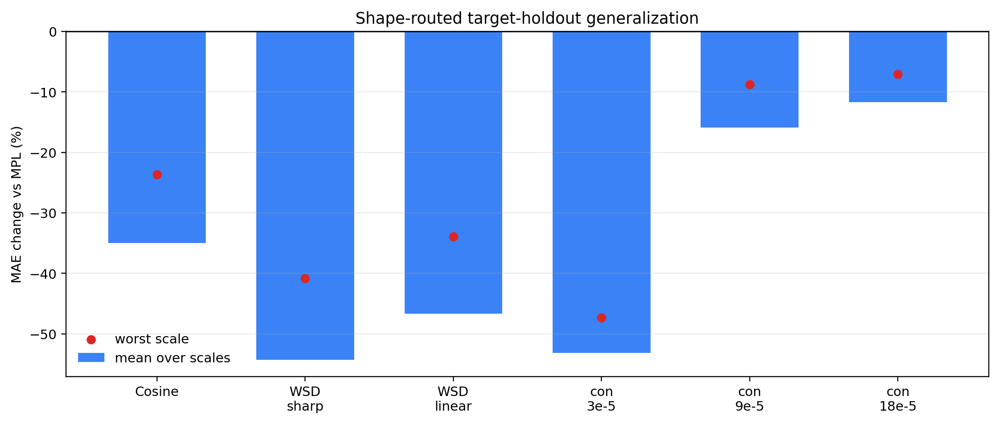

# Shape-Routed Step-Time Estimator

This is the stronger generalization head suggested by the residual figures.  The rule does not ask every calibration curve to predict every target.  Instead, the target LR schedule shape chooses a finite response time and a source calibration set.

## Route Rule

- Very long smooth decay: use a slow finite response (`tau=8192`) calibrated by the strongest full-drop step probe, with `dct4` nuisance projection.
- Finite WSD tail: use the paired finite-tail WSD curve when available and `tau=5120`.
- Full single-step drop: use finite-tail WSD curves, `tau=1536`, and `dct2` nuisance projection.
- Medium single-step drop: use neighboring step probes, `tau=768`, and `dct2` nuisance projection.
- Weak single-step drop: use the nearest stronger step probe and `tau=512`.

- No positive LR drop or short smooth cosine: use no transient correction.  These are safety gates, not performance claims.

The route uses only the LR schedule: total positive LR drop, positive-drop span, and whether the decay is smooth, finite-tail, or single-step.  Target loss residuals are not used by routing or kappa fitting.

## Main Result

- Shape-routed target-holdout: mean `-36.1%`, worst `-7.0%`, non-harm `18/18`.
- This is a target-holdout deployment audit: each target curve is predicted from other curve(s) selected by schedule shape.

## Route Table

| target | drop | span | route | source | tau | nuisance |
|---|---:|---:|---|---|---:|---|
| Cosine | 0.900 | 69839 | smooth_decay | `wsdcon_3` | 8192 | `dct4` |
| WSD sharp | 0.900 | 3999 | finite_tail | `wsdld_20000_24000` | 5120 | `none` |
| WSD linear | 0.900 | 3999 | finite_tail | `wsd_20000_24000` | 5120 | `none` |
| WSD-con 3e-5 | 0.900 | 1 | full_step_drop | `wsd_20000_24000+wsdld_20000_24000` | 1536 | `dct2` |
| WSD-con 9e-5 | 0.700 | 1 | medium_step_drop | `wsdcon_3+wsdcon_18` | 768 | `dct2` |
| WSD-con 18e-5 | 0.400 | 1 | weak_step_drop | `wsdcon_9` | 512 | `none` |

## Per-Target Summary

| target | mean | worst | non-harm |
|---|---:|---:|---:|
| Cosine | -35.0% | -23.7% | 3/3 |
| WSD sharp | -54.3% | -40.9% | 3/3 |
| WSD linear | -46.7% | -33.9% | 3/3 |
| WSD-con 3e-5 | -53.1% | -47.3% | 3/3 |
| WSD-con 9e-5 | -15.9% | -8.8% | 3/3 |
| WSD-con 18e-5 | -11.7% | -7.0% | 3/3 |

## Extended Safety Audit

The extended audit adds `cosine_24000`, `constant_24000`, and `constant_72000`.  The first is a short smooth-cosine control; the constants are zero-positive-drop controls.  The routed rule applies no transient correction to these cases.

- Extended all-target audit: mean `-24.1%`, worst `+0.0%`, non-harm `27/27`.
- Extra safety controls only: mean `+0.0%`, worst `+0.0%`, non-harm `9/9`.

| extra target | route | source | tau | mean | worst | non-harm |
|---|---|---|---:|---:|---:|---:|
| Cosine 24k | short_smooth_no_transfer | `none` | 0 | +0.0% | +0.0% | 3/3 |
| Constant 24k | no_lr_drop | `none` | 0 | +0.0% | +0.0% | 3/3 |
| Constant 72k | no_lr_drop | `none` | 0 | +0.0% | +0.0% | 3/3 |

## Ablation and Tau Robustness

| audit | mean | worst | non-harm | reading |
|---|---:|---:|---:|---|
| final_core | -36.1% | -7.0% | 18/18 | final routed rule on core target-holdout curves |
| final_extended | -24.1% | +0.0% | 27/27 | final routed rule plus cosine/constant safety controls |
| no_short_smooth_gate | -10.7% | +154.0% | 24/27 | ablation that lets cosine_24000 transfer as a long smooth decay |
| no_nuisance_projection | -32.0% | -0.4% | 18/18 | core routes with nuisance projection disabled |
| fixed_tau_1024 | -24.4% | +5.5% | 17/18 | core routes with one universal tau=1024 |
| tau_x0.5 | -27.9% | -3.6% | 18/18 | core routes with all nonzero taus multiplied by 0.5 |
| tau_x0.75 | -33.6% | -7.7% | 18/18 | core routes with all nonzero taus multiplied by 0.75 |
| tau_x1.25 | -35.6% | -3.2% | 18/18 | core routes with all nonzero taus multiplied by 1.25 |
| tau_x1.5 | -33.4% | +1.0% | 16/18 | core routes with all nonzero taus multiplied by 1.5 |
| tau_x2 | -28.3% | +11.0% | 14/18 | core routes with all nonzero taus multiplied by 2 |

## Comparison

| metric | mean | worst | non-harm |
|---|---:|---:|---:|
| decomposed_self_fit | -70.6% | -38.9% | 18/18 |
| decomposed_full_offdiag | -14.8% | +0.0% | 90/90 |
| long_probe_to_wsd | -42.0% | -25.6% | 6/6 |
| shape_routed_target_holdout | -36.1% | -7.0% | 18/18 |

## Protocol and Overfit Audits

- `PROTOCOL_AUDIT.md` checks target-loss blindness: committed routes match LR-schedule-only recomputation, the target curve is excluded from calibration, and scrambling the target residual leaves kappa and the correction unchanged.
- `OVERFIT_RISK_AUDIT.md` is the deliberately conservative reading: the result is stable across scale slices and local tau perturbations, but route/tau choices are still too benchmark-shaped to claim external prospective validation.

## Reading

- The previous decomposed estimator is still the right self-fit model: it explains the broad low-frequency residual without treating it as transferable lag.
- The shape-routed head is stronger for deployment because it does not average over impossible source-target pairs.  It asks: given this target schedule shape, which calibration schedule should supply the transient amplitude?
- This is still an internal schedule-family audit.  The next evidence needed is an external schedule family or a leave-family design with more than one curve per family.
